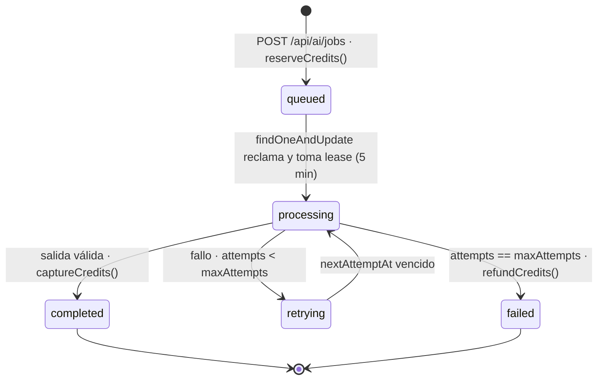

# Subsistema de generación con IA

Este documento describe el camino completo de una generación: desde que el
usuario pulsa *generar* hasta que el crédito se cobra o se devuelve. Es el
subsistema con más estados del proyecto y el único que mueve dinero, así que lo
que sigue está descrito con el nivel de detalle que exigiría una revisión de
incidentes.

---

## 1. Dos caminos, no uno

Hay **dos mecanismos distintos** de generación y conviene no confundirlos.

| | Camino síncrono | Camino asíncrono |
|---|---|---|
| Dónde vive | `src/lib/generation/provider-adapters.ts` (`'use client'`) | `src/app/api/ai/jobs/**` + `src/lib/ai-job-*.ts` |
| Cómo llama al proveedor | *Server actions* proxy (`proxyOpenAIChat`, `proxyGemini`, …) | Cola en MongoDB, consumida por un cron |
| Cuándo se usa | Edición interactiva: el usuario espera la respuesta | Trabajos largos: vídeo, proyectos, lotes |
| Créditos | No los descuenta | Reserva → captura/devuelve |

El registro de adaptadores existe para que **los editores no importen cada server
action por separado**: las formas de respuesta de cada proveedor se quedan
contenidas en ese archivo, y aguas arriba todo el mundo ve la misma interfaz.

El resto del documento trata el camino asíncrono, que es donde está el riesgo.

---

## 2. Proveedores por tipo de trabajo

`src/lib/ai-job-config.ts` es la **única fuente de verdad**; `isProviderForKind()`
la aplica en la entrada de la API, de modo que no es posible encolar un trabajo
de vídeo contra un proveedor de imagen.

| Tipo | Créditos | Coste estimado | Proveedores admitidos |
|---|---|---|---|
| `image` | 1 | 0,04 USD | `google`, `openai`, `fal`, `replicate` |
| `video` | 3 | 0,35 USD | `runway`, `veo`, `kling`, `luma`, `pika`, `hailuo`, `sora` |
| `project` | 2 | 0,08 USD | `google`, `openai`, `anthropic`, `deepseek` |

El coste en créditos es fijo y conocido **antes** de llamar al proveedor; el coste
real en dólares se mide después (`actualProviderCost`) y se guarda en el trabajo.
Esa diferencia es lo que permite saber si la tarifa está mal calibrada.

---

## 3. Ciclo de vida del trabajo



### Cómo se reclama un trabajo

`/api/ai/jobs/process` no hace «leer y luego escribir». Usa un
`findOneAndUpdate` atómico que en la misma operación filtra, marca como
`processing`, incrementa `attempts` y fija un **lease de 5 minutos**:

```ts
{ status: { $in: ['queued','retrying','processing'] },
  nextAttemptAt: { $lte: now },
  $or: [{ leaseExpiresAt: null }, { leaseExpiresAt: { $lte: now } }] }
```

Dos consecuencias deliberadas:

1. **Dos crons concurrentes no pueden tomar el mismo trabajo.** El filtro y la
   escritura son una sola operación de MongoDB.
2. **Un worker que muere no bloquea el trabajo para siempre.** Por eso
   `processing` aparece en el `$in`: pasados 5 minutos el lease caduca y otro
   intento lo recoge. Sin esto, un proceso caído dejaría créditos reservados
   indefinidamente.

El endpoint procesa entre 1 y 5 trabajos por invocación (`limit`, acotado en el
servidor) y está protegido por `hasValidCronSecret`, no por sesión.

### Reintentos

Retroceso exponencial en minutos: `2 ** (attempts - 1)` → 1, 2, 4, 8…
`maxAttempts` vale 3 por defecto y está acotado entre 1 y 5 en el esquema.
Al agotarlo el trabajo pasa a `failed`, **se devuelven los créditos**
y se avisa al usuario por correo indicando el número de intentos.

---

## 4. Créditos: reservar, capturar, devolver

`src/lib/ai-job-service.ts`. La cuenta guarda tres números: `balance`,
`reserved` y `lifetimeSpent`. Saldo inicial:
`Math.max(0, Number(process.env.AI_INITIAL_CREDITS ?? 12))`.

**Reserva.** Es la operación crítica y es condicional:

```ts
AICreditAccount.findOneAndUpdate(
  { userId: job.userId, balance: { $gte: job.creditCost } },
  { $inc: { balance: -job.creditCost, reserved: job.creditCost } },
  { returnDocument: 'after' })
```

La comprobación de saldo vive **en el filtro**, no en un `if` de JavaScript. Si
dos peticiones llegan a la vez con saldo para una sola, la segunda no encuentra
documento y `reserveCredits` devuelve `null`: el trabajo no se encola. Un saldo
comprobado en código y descontado después sí permitiría el saldo negativo.

El apunte en `ai_credit_ledger` es un **upsert con clave `{jobId, operation}`**,
de modo que reintentar la reserva no duplica el movimiento.

**Captura y devolución** son idempotentes por guarda explícita:

```ts
if (job.creditsState !== 'reserved') return;
```

Llamar dos veces a `captureCredits` no cobra dos veces. La invariante del
sistema es que **ningún trabajo termina con sus créditos en `reserved`**: o pasa
a `captured` o a `refunded`.

---

## 5. Contratos de salida

Un trabajo puede llevar asociado un `OutputContract`. Entonces intervienen dos
funciones de `src/lib/output-contract.ts`:

- **`contractInstructions(contract)`** se antepone al prompt antes de llamar al
  proveedor: modo (`json` / `code` / `text`), longitud máxima, idioma, tono y
  palabras prohibidas.
- **`validateAndRepairOutput(result, contract)`** valida la respuesta y, si el
  contrato tiene `autoRepair`, intenta arreglarla: recorta a `maxLength` y
  sustituye las palabras prohibidas por `[omitido]`; en modo JSON repara contra
  el esquema.

El resultado es uno de tres estados: `valid`, `repaired`, `invalid`. Un
`invalid` **lanza**, y por tanto cuenta como fallo del intento: entra en el
camino de reintento y, si se agotan, en la devolución de créditos. Es decir, una
salida que incumple el contrato no se le cobra al usuario.

---

## 6. El worker externo

`runAIJob` (`src/lib/ai-job-runner.ts`) tiene una sola excepción local:
imagen con `google` y sin worker configurado se resuelve en proceso con el flujo
de Genkit. Todo lo demás va a `AI_GENERATION_WORKER_URL` con:

- `Authorization: Bearer <AI_GENERATION_WORKER_TOKEN>`
- `Idempotency-Key: <job.idempotencyKey>` — para que un reintento tras un timeout
  de red no produzca una segunda generación cobrada por el proveedor. La misma
  clave está respaldada por un índice único `{userId, idempotencyKey}` en
  `ai_generation_jobs`, así que el duplicado tampoco puede encolarse dos veces.
- `AbortSignal.timeout(270_000)` — 270 s, por debajo del `maxDuration = 300` de
  la ruta, para que el timeout lo produzca nuestro código con un mensaje útil en
  vez de matarlo la plataforma.
- Un tope de **2 MB** sobre el resultado serializado; por encima se exige
  devolver una URL de R2 en lugar del binario, porque el resultado se guarda en
  el documento del trabajo.

---

## 7. Modo determinista para pruebas

Con `NEXT_PUBLIC_E2E_TEST_MODE=true`, los adaptadores no llaman a ningún
proveedor: devuelven respuestas fijas. Además, un prompt que contenga el marcador
`[fail-once]` **falla exactamente el primer intento y funciona en el segundo**:

```ts
if (prompt.includes('[fail-once]') && e2eOpenAIFailures++ === 0) {
  return { error: 'Temporary provider failure' };
}
```

Esto hace comprobable el camino de reintento, que de otro modo solo se
ejercitaría cuando un proveedor real fallase. Lo usa
`tests/e2e/user-journeys.spec.ts`.

---

## 8. Observabilidad

Cada transición relevante emite un evento a `observability_events`:
`generation_completed`, `generation_retry_scheduled`, `generation_failed`. Todos
llevan `jobId` como `correlationId`, el proveedor, el número de intentos y el
coste, lo que permite responder a «qué proveedor falla más» y «cuánto nos cuesta
de verdad cada tipo» sin instrumentación adicional.

Esos eventos **caducan a los 90 días** por TTL; véase
[DATABASE.md](DATABASE.md) §5.

---

## 9. Cómo comprobar lo anterior

```bash
# Proveedores y costes por tipo
cat src/lib/ai-job-config.ts

# Máquina de estados y reintentos
sed -n '19,90p' src/app/api/ai/jobs/process/route.ts

# Reserva condicional de créditos
sed -n '19,63p' src/lib/ai-job-service.ts

# Pruebas del subsistema
npx tsx --test tests/unit/output-contract.test.ts tests/unit/credit-topup.test.ts
```

Contexto de capas: [ARCHITECTURE.md](ARCHITECTURE.md). Modelos y colecciones:
[DATABASE.md](DATABASE.md).
