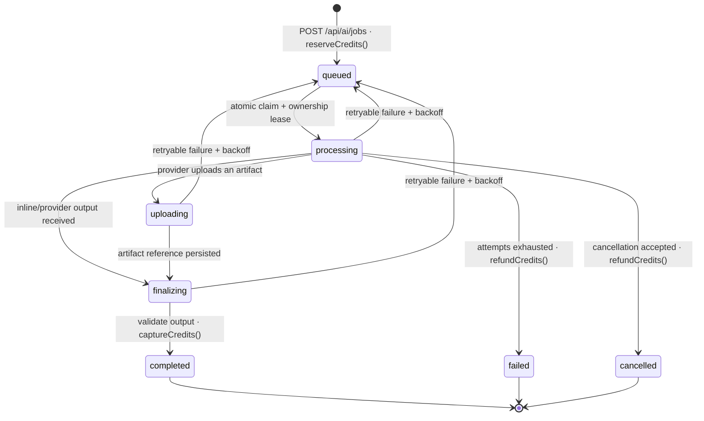

# AI Generation Subsystem

This document describes the complete flow of a generation: from the moment the
user clicks *generate* until the credit is charged or refunded. It is the
subsystem with the most states in the project and the only one that handles
money, so the following is described with the level of detail that an incident
review would require.

---

## 1. Two paths, not one

There are **two distinct mechanisms** for generation and they should not be
confused.

| | Synchronous path | Asynchronous path |
|---|---|---|
| Where it lives | [`src/lib/generation/provider-adapters.ts`](../src/lib/generation/provider-adapters.ts) (`'use client'`) | [`src/app/api/ai/jobs/`](../src/app/api/ai/jobs/) + [`src/lib/ai-job-config.ts`](../src/lib/ai-job-config.ts), [`src/lib/ai-job-runner.ts`](../src/lib/ai-job-runner.ts), and [`src/lib/ai-job-service.ts`](../src/lib/ai-job-service.ts) |
| How it calls the provider | *Server actions* proxy (`proxyOpenAIChat`, `proxyGemini`, …) | MongoDB queue, drained by calls to `/api/ai/jobs/process` |
| When it is used | Interactive editing: the user waits for the response | Long jobs: video, projects, batches |
| Credits | Does not deduct them | Reserve → capture/refund |

The adapter registry exists so that **editors do not import each server action
separately**: the response shapes of each provider remain contained in that
file, and upstream everyone sees the same interface.

The rest of the document covers the asynchronous path, which is where the risk
lies.

---

## 2. Providers by job type

[`src/lib/ai-job-config.ts`](../src/lib/ai-job-config.ts) is the **single source of truth**; `isProviderForKind()`
applies it at the API entry point, so that it is not possible to queue a video
job against an image provider.

| Type | Credits | Estimated cost | Supported providers |
|---|---|---|---|
| `image` | 1 | 0.04 USD | `google`, `openai`, `fal`, `replicate` |
| `video` | 3 | 0.35 USD | `runway`, `veo`, `kling`, `luma`, `pika`, `hailuo`, `sora` |
| `project` | 2 | 0.08 USD | `google`, `openai`, `anthropic`, `deepseek` |

The cost in credits is fixed and known **before** calling the provider; the actual
cost in dollars is measured afterwards (`actualProviderCost`) and saved in the
job. This difference is what allows determining if the rate is poorly calibrated.

---

## 3. Job lifecycle



### How a job is claimed

[`/api/ai/jobs/process`](../src/app/api/ai/jobs/process/route.ts) does not do "read and then write". It uses an atomic
`findOneAndUpdate` that in the same operation filters, marks as `processing`,
increments `attempts`, and sets a **5-minute ownership lease** with a unique
`lockToken`:

```ts
{ status: { $in: ['queued','retrying','processing','uploading','finalizing'] },
  nextAttemptAt: { $lte: now },
  $or: [{ leaseExpiresAt: null }, { leaseExpiresAt: { $lte: now } }] }
```

Two deliberate consequences:

1. **Two concurrent crons cannot take the same job.** The filter and write are a
   single MongoDB operation.
2. **A worker that dies does not block the job forever.** That is why
   active states appear in the `$in`: after 5 minutes the lease expires and
   another attempt picks it up. Without this, a crashed process would leave
   credits reserved indefinitely.

Every state change also filters by the expected state and `lockToken`, so an
expired worker cannot overwrite a newer attempt. Legacy `retrying` records are
read as canonical `queued`; new retries are persisted as `queued`. See the
[canonical state-machine contract](architecture/generation-job-state-machine.md).

The endpoint processes between 1 and 5 jobs per invocation (`limit`, bounded on the
server) and is protected by `hasValidCronSecret`, not by session.

> **Vercel Cron calls it every minute** (`vercel.json`), so this endpoint is
> also the safety net: if QStash is unavailable or `AI_QUEUE_KILL_SWITCH` is on,
> the queue drains on the next minute instead of stalling.

### Stuck-job recovery sweeper

`GET|POST /api/ai/jobs/sweep` runs every 5 minutes, separate from the generation
queue on purpose: recovery is scheduled work, not part of a normal execution.

A job is *stuck* when it is in `processing`, `uploading` or `finalizing`, its
lease has expired, and it has shown no sign of life (`updatedAt`) for longer than
the threshold for its kind — 10 min for `text` up to 45 min for `video`, all of
them comfortably above the 5-minute processor lease. The oldest job is claimed
first, with the same compare-and-swap and lease machinery the queue uses, so two
concurrent sweeps cannot both take the same job.

The decision is delegated to the ordinary retry policy with category `timeout`,
so there is only one rule to keep consistent:

| Situation | Action | Credits |
| --- | --- | --- |
| Attempts remain | Requeued to `queued` with its generation idempotency key untouched | Untouched — the same reservation is what the next execution will capture |
| Attempts exhausted | `dead_letter` | Reserved credits refunded |
| Attempts exhausted with a `providerRequestId` | `dead_letter`, and the reason records that a provider request existed | Reserved credits refunded |

Requeueing never touches the balance: refunding there would be a double charge
from the user's point of view. Refunds stay idempotent through the
`creditsState` guard and the unique `(jobId, operation)` ledger index.

The transition starts from the state the job is *actually* in, not always from
`processing`. That matters for `finalizing`: a stuck job there has usually
already captured, and closing it through a `processing → failed` filter does not
match, which would leave the reservation stranded.

Every action records `recovery` on the job (reason, timestamp, owner, the
`lastSweepId` that touched it, and any `providerRequestId` worth following up)
and emits an `ai_generation` event, so a recovered job is distinguishable from a
clean one and an operator can trace it to the sweep that closed it.

### Retries

Exponential backoff in minutes: `2 ** (attempts - 1)` → 1, 2, 4, 8…
`maxAttempts` defaults to 3 and is bounded between 1 and 5 in the schema.
Upon exhausting it, the job transitions to `failed`, **credits are refunded**,
and the user is notified by email indicating the number of attempts.

---

## 4. Credits: reserve, capture, refund

[`src/lib/ai-job-service.ts`](../src/lib/ai-job-service.ts) stores the account's three numbers: `balance`,
`reserved`, and `lifetimeSpent`. Initial balance:
`Math.max(0, Number(process.env.AI_INITIAL_CREDITS ?? 12))`.

**Reservation.** This is the critical operation and it is conditional:

```ts
AICreditAccount.findOneAndUpdate(
  { userId: job.userId, balance: { $gte: job.creditCost } },
  { $inc: { balance: -job.creditCost, reserved: job.creditCost } },
  { returnDocument: 'after' })
```

The balance check lives **in the filter**, not in a JavaScript `if`. If two
requests arrive at the same time with enough balance for only one, the second
finds no document and `reserveCredits` returns `null`: the job is not queued. A
balance checked in code and deducted later would allow a negative balance.

The entry in `ai_credit_ledger` is an **upsert with key `{jobId, operation}`**,
so retrying the reservation does not duplicate the transaction.

**Capture and refund** are idempotent via an explicit guard:

```ts
if (job.creditsState !== 'reserved') return;
```

Calling `captureCredits` twice does not charge twice. The system invariant is that
**no job finishes with its credits in `reserved`**: it either moves to
`captured` or to `refunded`.

---

## 5. Output contracts

A job can have an associated `OutputContract`. In that case, two functions from
[`src/lib/output-contract.ts`](../src/lib/output-contract.ts) step in:

- **`contractInstructions(contract)`** is prepended to the prompt before calling
  the provider: mode (`json` / `code` / `text`), maximum length, language, tone,
  and prohibited words.
- **`validateAndRepairOutput(result, contract)`** validates the response and, if
  the contract has `autoRepair`, attempts to fix it: truncates to `maxLength`
  and replaces prohibited words with `[omitido]`; in JSON mode it repairs against
  the schema.

The result is one of three states: `valid`, `repaired`, `invalid`. An `invalid`
**throws**, and therefore counts as an attempt failure: it enters the retry path
and, if exhausted, the credit refund path. That is, an output that violates the
contract is not charged to the user.

---

## 6. The external worker

`runAIJob` ([`src/lib/ai-job-runner.ts`](../src/lib/ai-job-runner.ts)) has a single local exception: image
with `google` and no configured worker is resolved in-process using the Genkit
flow. Everything else goes to `AI_GENERATION_WORKER_URL` with:

- `Authorization: Bearer <AI_GENERATION_WORKER_TOKEN>`
- `Idempotency-Key: <job.idempotencyKey>` — so that a retry after a network timeout
  does not produce a second generation charged by the provider. The same key is
  backed by a unique index `{userId, idempotencyKey}` on `ai_generation_jobs`,
  so the duplicate cannot be queued twice either.
- `AbortSignal.timeout(270_000)` — 270 s, below the route's `maxDuration = 300`,
  so that the timeout is triggered by our code with a useful message instead of
  being killed by the platform.
- A limit of **2 MB** on the serialized result; above this, returning an R2 URL
  instead of the binary is required, because the result is saved in the job
  document.

---

## 7. Deterministic test mode

With `NEXT_PUBLIC_E2E_TEST_MODE=true`, adapters do not call any provider:
they return fixed responses. Additionally, a prompt containing the `[fail-once]`
marker **fails on exactly the first attempt and succeeds on the second**:

```ts
if (prompt.includes('[fail-once]') && e2eOpenAIFailures++ === 0) {
  return { error: 'Temporary provider failure' };
}
```

This makes the retry path testable, which would otherwise only be exercised
when a real provider failed. It is used by [`tests/e2e/user-journeys.spec.ts`](../tests/e2e/user-journeys.spec.ts).

---

## 8. Observability

Every relevant transition emits an event to `observability_events`:
`generation_completed`, `generation_retry_scheduled`, `generation_failed`. All
carry `jobId` as `correlationId`, the provider, the number of attempts, and the
cost, allowing questions such as "which provider fails the most" and "how much
each type actually costs us" to be answered without additional instrumentation.

These events **expire after 90 days** via TTL; see [DATABASE.md](DATABASE.md) §5.

---

## 9. How to verify the above

```bash
# Proveedores y costes por tipo
cat src/lib/ai-job-config.ts

# Máquina de estados y reintentos
sed -n '19,90p' src/app/api/ai/jobs/process/route.ts

# Reserva condicional de créditos
sed -n '19,63p' src/lib/ai-job-service.ts

# Pruebas del subsistema
npx tsx --test tests/unit/output-contract.test.ts tests/unit/credit-topup.test.ts
```

Layer context: [ARCHITECTURE.md](ARCHITECTURE.md). Models and collections:
[DATABASE.md](DATABASE.md).
