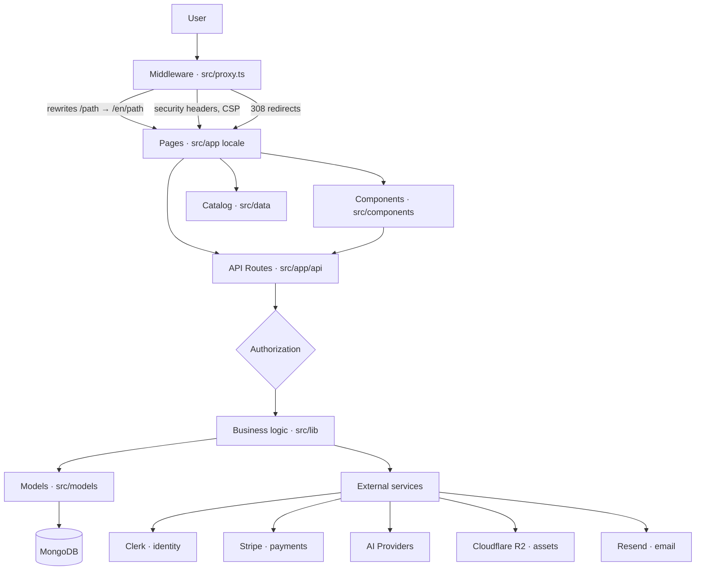
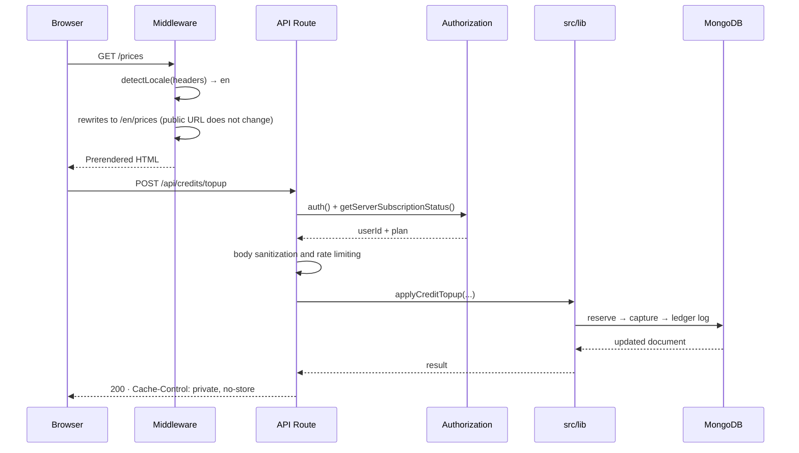
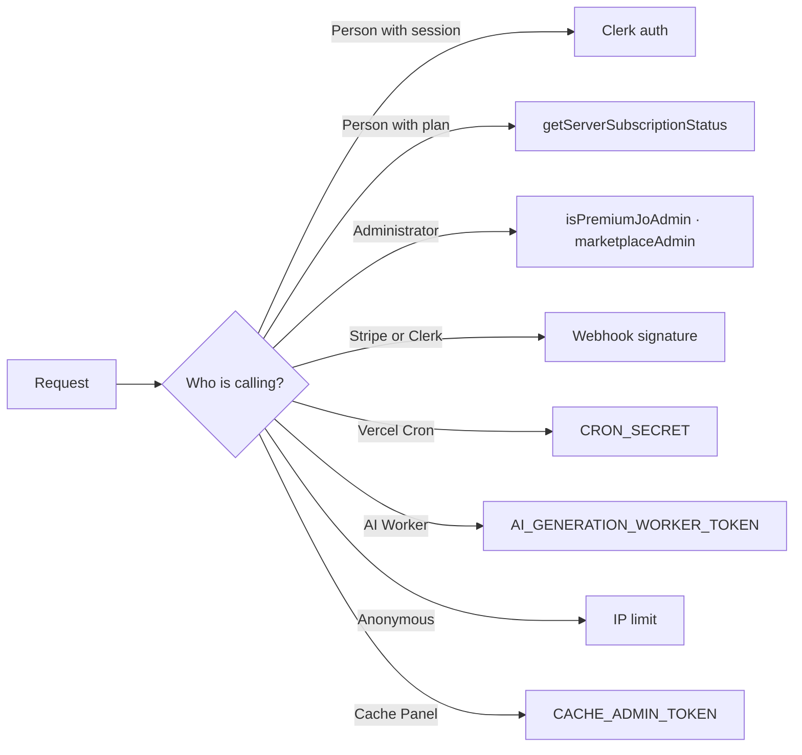
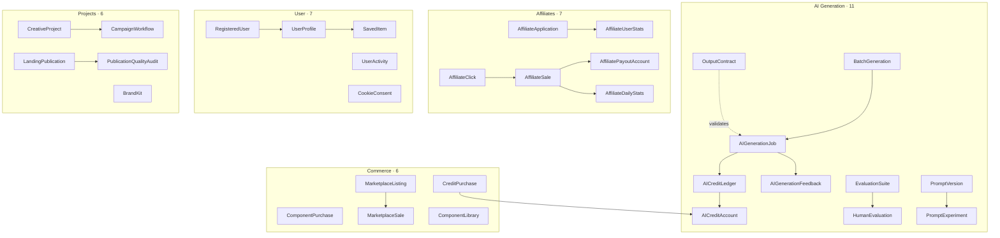
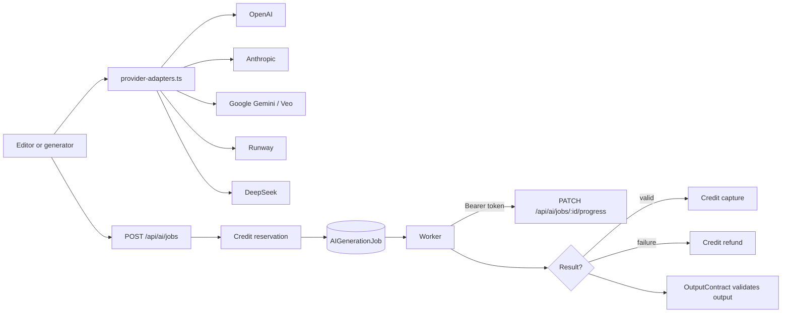
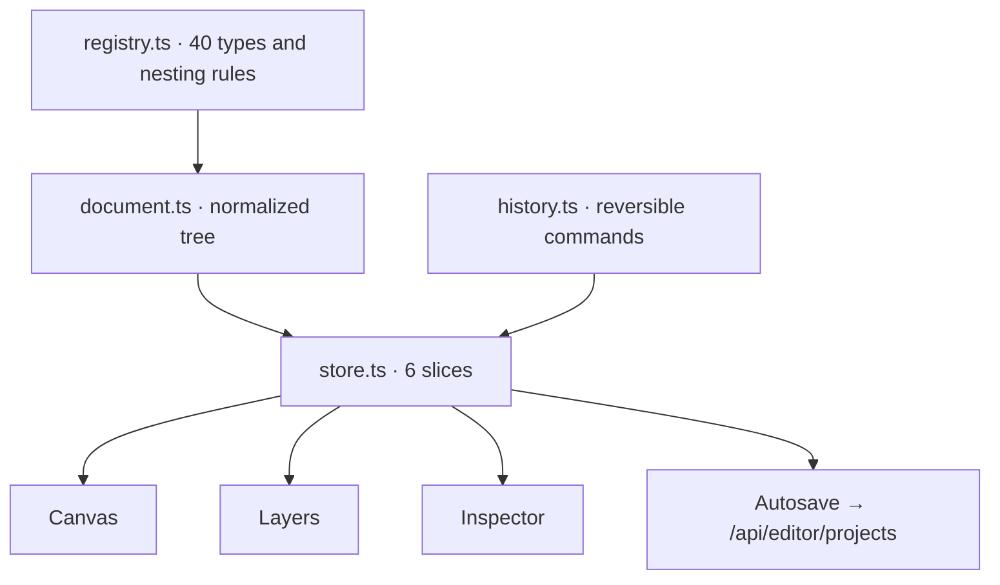

# Architecture

How Prompt Studio is built and **why** it's built this way. Everything that follows is measured against the code as of September 11, 2026; the commands to reproduce each figure are in §9.

---

## 1. Overview



| Layer | Files | Responsibility |
|---|---|---|
| **Middleware** ([`src/proxy.ts`](../src/proxy.ts)) | 1 | Language, canonical redirects, security headers, catalog source protection |
| **Pages** ([`src/app/[locale]`](../src/app/[locale])) | 91 routes | Interface composition; server by default, client only where there is interaction |
| **API** ([`src/app/api`](../src/app/api)) | 105 routes | Authorization, input validation, and orchestration |
| **Components** ([`src/components`](../src/components)) | 156 | Reusable interface, without data access |
| **Logic** ([`src/lib`](../src/lib)) | 155 | Pure business rules, without React or Mongo |
| **Models** ([`src/models`](../src/models)) | 45 | Mongoose schemas and their indexes |
| **Catalog** ([`src/data`](../src/data)) | 15 JSON | Versioned product; intentionally outside of `public/` |

---

## 2. Request lifecycle



### Decision: language is resolved in the middleware

`src/i18n/request.ts` used to read `cookies()` and `headers()` in the root layout. This marked **all 121 routes as dynamic** and made it impossible to cache anything; `revalidate` was useless.

Now the middleware detects the language and **rewrites** to `/{locale}/…`. Pages receive the language as a route parameter and are prerendered, while the public URL remains prefix-free. Measured result: from 121 dynamic routes to 60, with 202 prerendered pages.

Requirement paid for this: each page needs `setRequestLocale(locale)`. Without this call, `getMessages()` reads headers again and all gains are lost —this happened in `/component-builder`, which served the English payment gateway to visitors with `x-locale: es`—.

---

## 3. Authorization

The system authorizes using **eight mechanisms**, each for a different caller type:



| Mechanism | Routes | Where it lives |
|---|---|---|
| User session | 60 | `auth()` from Clerk ([`src/proxy.ts`](../src/proxy.ts)) |
| IP limit | 34 | [`src/lib/rate-limit.ts`](../src/lib/rate-limit.ts) |
| Subscription plan | 12 | [`src/lib/server-subscription-status.ts`](../src/lib/server-subscription-status.ts) |
| Administrator | 9 | [`src/lib/admin-auth.ts`](../src/lib/admin-auth.ts), [`src/lib/marketplace-admin.ts`](../src/lib/marketplace-admin.ts), [`src/lib/cache-admin-auth.ts`](../src/lib/cache-admin-auth.ts) |
| Cron secret | 6 | [`src/lib/api-auth.ts`](../src/lib/api-auth.ts) |
| Webhook signature | 2 | Stripe `constructEvent`, Clerk `svix` |
| Worker token | 1 | `AI_GENERATION_WORKER_TOKEN` |
| Disabled (501) | 2 | [`src/app/api/like/route.ts`](../src/app/api/like/route.ts), [`src/app/api/seed/route.ts`](../src/app/api/seed/route.ts) |

**The problem this created**: with eight mechanisms spread across 105 files, knowing if a route was protected required opening and reading it. This already cost two bugs: two routes under `/api/admin` had the admin check **copied inline** instead of using the helper, and `/api/affiliate/applications` accepted anonymous writes **without IP limits**.

**The solution**: [`docs/API_ACCESS.md`](API_ACCESS.md) is a document **generated** by `scripts/mjs/build-route-access-matrix.mjs`, and `tests/unit/route-access-matrix.test.ts` turns it into a contract:

- no route can be left without a recognized mechanism or written justification;
- every route under `/api/admin` must check admin, not just session;
- every write without a session must be IP limited.

A new unprotected route **breaks the pipeline** instead of being deployed.

---

## 4. Data domains

45 Mongoose models, grouped by domain:



The field-by-field details are in [docs/dm.md](dm.md).

### Decision: three-phase credit ledger

`AICreditLedger.operation` is an enum `['reserve', 'capture', 'refund']` tied to the `jobId`. Credit is reserved when queueing the job, captured when completing it, and refunded if it fails.

The alternative —a decremented counter— loses money as soon as a generation fails halfway: there is no way to know how much to refund or to audit what happened. With reserve-capture, every movement is logged, and the balance is reconstructible.

### Decision: the catalog lives in `src/data`, not in `public/`

It used to be in `public/webpages/`, meaning it was **downloadable with the paid prompts inside**. The public derivative is intentionally cleared (`build-paged-catalogs.mjs` deletes `description`, where the prompt lives), but that doesn't protect the sources if the sources are in `public/`.

Three failed attempts taught the rule applied today:

1. A whitelist of 8 filenames aged poorly: an audit found **9 more files** with paid products that no one had added.
2. `precompress-static.mjs` generates `.br` and `.gz` variants, so a rule against `*.json` leaves `*.json.br` open.
3. The `headers()` in `next.config.ts` with two lookaheads behaved **backwards**: they applied to `/api/*`, which was excluded.

**Resulting rule**: block by directory, never by filename list; cover all three file forms; and make the test **traverse the real directory** instead of listing what needs to be protected.

---

## 5. AI Generation



Five provider families behind **a single interface** ([`src/lib/generation/provider-adapters.ts`](../src/lib/generation/provider-adapters.ts)). What makes this registry useful is not unifying calls, but that the rest of the system —credits, retries, evaluation— doesn't need to know which provider responded.

Includes a **deterministic testing mode**: with `NEXT_PUBLIC_E2E_TEST_MODE`, a prompt containing `[fail-once]` forces a provider failure the first time. Used to test the error path, which is usually untested.

---

## 6. Visual editor

The editor does not share the application's React state: it has its own document, its own history, and its own component registry.

Core implementation:
- Registry: [`src/lib/editor/registry.ts`](../src/lib/editor/registry.ts) (40 types and nesting rules)
- Document Tree: [`src/lib/editor/document.ts`](../src/lib/editor/document.ts) (normalized tree)
- Reactive Store: [`src/lib/editor/store.ts`](../src/lib/editor/store.ts) (6 state slices)
- Reversible Commands: [`src/lib/editor/history.ts`](../src/lib/editor/history.ts) (undo / redo stack)
- Editor UI: [`src/components/editor/`](../src/components)



Three decisions and their reasons:

- **Normalized tree** (`nodes: Record<id, node>` + `children: id[]`) instead of nested nodes: with 1,000 nodes, a nested tree forces cloning the entire branch on each change; with a flat map, you touch a node and only that node changes identity.
- **Reversible commands**, not snapshots: a snapshot per keystroke wastes megabytes and makes autosave send the entire document per key. Additionally, commands are serializable data, which is the format an AI assistant can emit to modify the same tree the person edits.
- **`useSyncExternalStore` instead of Zustand**: what's needed is subscription by selector, and that comes in React 19. The builder route already loads ~300 kB of JavaScript; adding a dependency for syntactic sugar isn't worth it. If middlewares are needed, `store.ts` is the only piece to replace.

Full detail in [docs/editor/plan-editor-visual.md](editor/plan-editor-visual.md).

---

## 7. Boundaries between layers

The allowed direction is **app → lib → models**, and it is generally respected:

| Import | Files | Correct? |
|---|---|---|
| `components` → `lib` | 111 | Yes |
| `api` → `lib` | 103 | Yes |
| `api` → `models` | 68 | Yes |
| `lib` → `app` | 2 | **No** |
| `lib` → `components` | 1 | **No** |
| `models` → `lib` | 1 | **No** |

The four exceptions, with their explanation:

- `lib/generation/provider-adapters.ts` → `@/app/actions`: the provider registry invokes *server actions*, which live in `app/`. It's a real coupling; the clean exit would be moving the actions to `lib/` and leaving only the `'use server'` wrapper in `app/`.
- `lib/subscription-status-cache.ts` → `@/app/api`: imports the route's response type. Fixed by moving the type to `lib/`.
- `lib/landing-readability-badge.ts` → `@/components/readability-badge`: logic deciding a badge imports the component that paints it. Inverting the dependency is trivial.
- `models/AIGenerationFeedback.ts` → `lib/generation-feedback`: the model imports domain constants. It's the most defensible of the four.

None is urgent; all four are documented so they don't multiply.

---

## 8. Cache

Ten modules, each at a different boundary:

| Module | Where it acts |
|---|---|
| `cache-policy.ts` | `Cache-Control` headers by response type |
| `cache-namespace-policy.ts` | Namespaces and their invalidation |
| `server-cache.ts` · `lru-cache-store.ts` | Server memory |
| `cached-fs.ts` | Catalog reads from disk |
| `cdn-cache.ts` | `CDN-Cache-Control` for the edge |
| `client-lru-cache.ts` · `subscription-status-cache.ts` | Browser |
| `sw-cache-strategies.ts` | Service worker |
| `rate-limit-core.ts` | Counters in Upstash Redis |

`npm run cache:audit` checks that public, private, and `no-store` policies do not contradict each other; it's part of `npm run validate`.

**Learned rule**: per-user content is always marked `private, no-store`. A shared cache indexed by the public URL would serve the English version to a Spanish visitor because the URL does not carry the language.

---

## 9. How to reproduce the figures

```bash
# Layers and sizes
for d in src/app src/components src/lib src/models; do
  echo "$d: $(find $d -name '*.ts' -o -name '*.tsx' | wc -l) files"
done

# Routes and models
find src/app/api -name route.ts | wc -l && ls src/models/*.ts | wc -l

# Access matrix (generated document)
node scripts/mjs/build-route-access-matrix.mjs
node --import tsx --test tests/unit/route-access-matrix.test.ts

# Boundaries between layers
grep -rl "@/components" src/lib --include='*.ts' | wc -l
grep -rl "@/app" src/lib --include='*.ts' | wc -l
grep -rl "@/lib" src/models --include='*.ts' | wc -l
```
