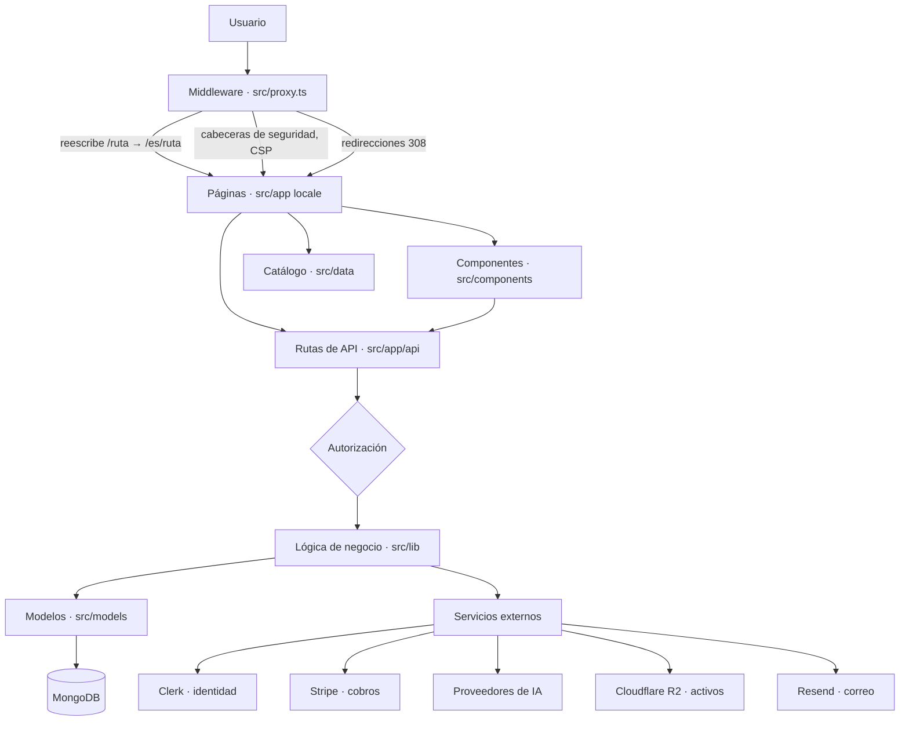
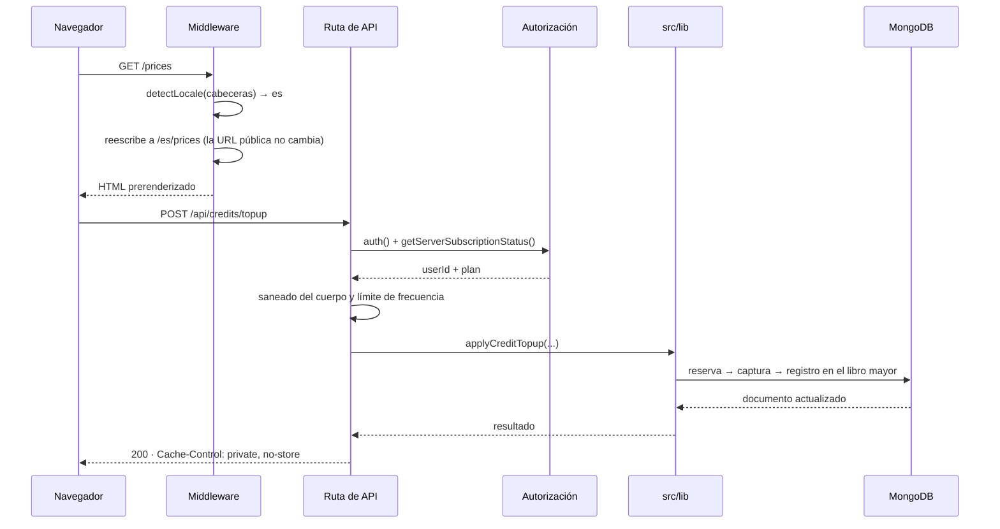
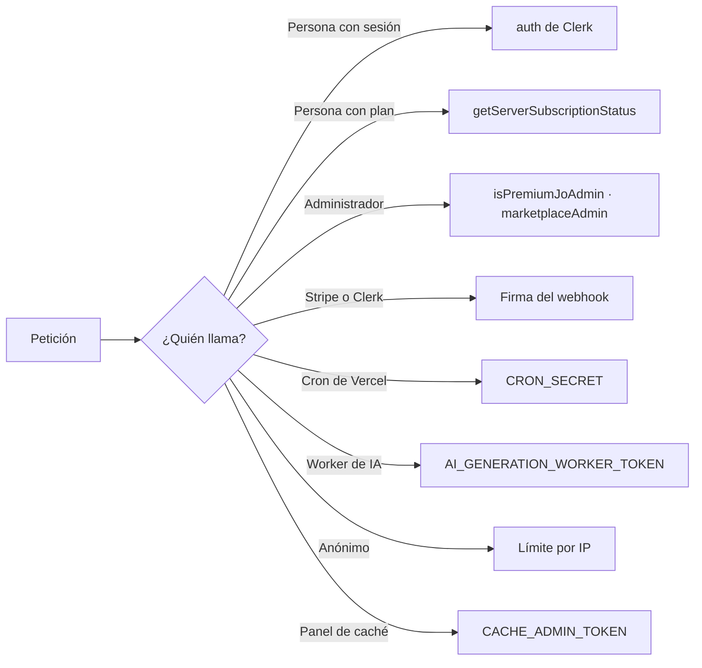
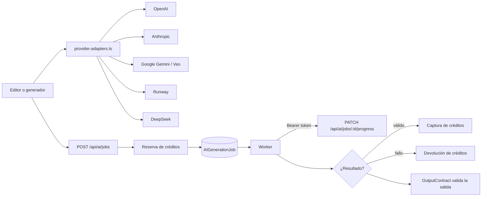
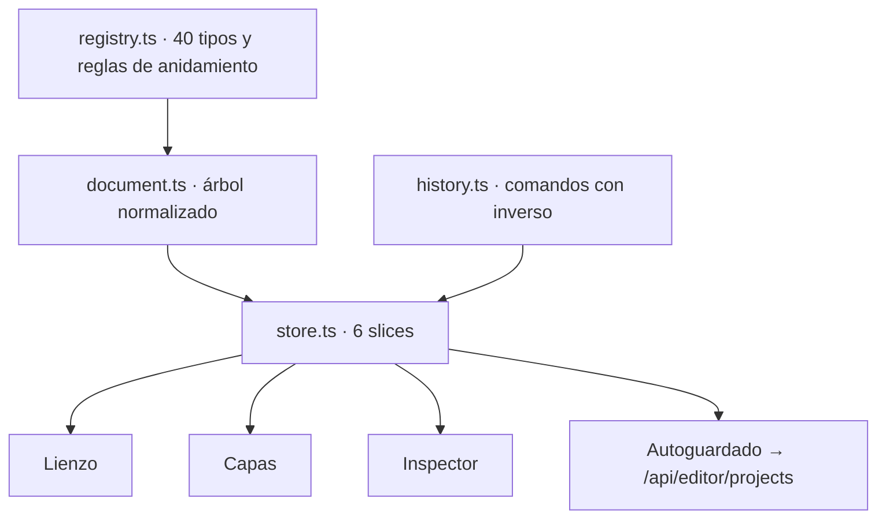

# Arquitectura

Cómo está montado Prompt Studio y **por qué** está montado así. Todo lo que
sigue está medido sobre el código a 11 de septiembre de 2026; los comandos para
reproducir cada cifra están en el §9.

---

## 1. Vista general



| Capa | Ficheros | Responsabilidad |
|---|---|---|
| **Middleware** (`src/proxy.ts`) | 1 | Idioma, redirecciones canónicas, cabeceras de seguridad, protección de fuentes del catálogo |
| **Páginas** (`src/app/[locale]`) | 91 rutas | Composición de la interfaz; servidor por defecto, cliente solo donde hay interacción |
| **API** (`src/app/api`) | 105 rutas | Autorización, validación de entrada y orquestación |
| **Componentes** (`src/components`) | 156 | Interfaz reutilizable, sin acceso a datos |
| **Lógica** (`src/lib`) | 155 | Reglas de negocio puras, sin React ni Mongo |
| **Modelos** (`src/models`) | 45 | Esquemas de Mongoose y sus índices |
| **Catálogo** (`src/data`) | 15 JSON | Producto versionado; fuera de `public/` a propósito |

---

## 2. Recorrido de una petición



### Decisión: el idioma se resuelve en el middleware

`src/i18n/request.ts` leía `cookies()` y `headers()` en el layout raíz. Eso
marcaba **las 121 rutas como dinámicas** y hacía imposible cachear nada;
`revalidate` no servía de nada.

Ahora el middleware detecta el idioma y **reescribe** a `/{locale}/…`. Las
páginas reciben el idioma como parámetro de ruta y se prerenderizan, mientras la
URL pública sigue sin prefijo. Resultado medido: de 121 rutas dinámicas a 60, con
202 páginas prerenderizadas.

Requisito que se paga por ello: cada página necesita `setRequestLocale(locale)`.
Sin esa llamada, `getMessages()` vuelve a leer cabeceras y se pierde todo lo
ganado —ocurrió en `/component-builder`, que servía la puerta de pago en inglés a
visitantes con `x-locale: es`—.

---

## 3. Autorización

El sistema autoriza con **ocho mecanismos**, cada uno para un tipo de llamante
distinto:



| Mecanismo | Rutas | Dónde vive |
|---|---|---|
| Sesión de usuario | 60 | `auth()` de Clerk |
| Límite por IP | 34 | `src/lib/rate-limit.ts` |
| Plan de suscripción | 12 | `src/lib/server-subscription-status.ts` |
| Administrador | 9 | `src/lib/admin-auth.ts`, `marketplace-admin.ts`, `cache-admin-auth.ts` |
| Secreto de cron | 6 | `src/lib/api-auth.ts` |
| Firma de webhook | 2 | Stripe `constructEvent`, Clerk `svix` |
| Token del worker | 1 | `AI_GENERATION_WORKER_TOKEN` |
| Deshabilitada (501) | 2 | `api/like`, `api/seed` |

**El problema que esto creaba**: con ocho mecanismos repartidos en 105 ficheros,
saber si una ruta estaba protegida exigía abrirla y leerla. Ya costó dos
defectos: dos rutas de `/api/admin` tenían la comprobación de administrador
**copiada en línea** en vez de usar el helper, y `/api/affiliate/applications`
aceptaba escrituras anónimas **sin límite por IP**.

**La solución**: [`docs/API_ACCESS.md`](API_ACCESS.md) es un documento
**generado** por `scripts/mjs/build-route-access-matrix.mjs`, y
`tests/unit/route-access-matrix.test.ts` lo convierte en contrato:

- ninguna ruta puede quedarse sin mecanismo reconocido ni justificación escrita;
- toda ruta bajo `/api/admin` debe comprobar administrador, no solo sesión;
- toda escritura sin sesión debe estar limitada por IP.

Una ruta nueva desprotegida **rompe el pipeline** en lugar de desplegarse.

---

## 4. Dominios de datos

45 modelos de Mongoose, agrupados por dominio:


El detalle campo a campo está en [docs/dm.md](dm.md).

### Decisión: libro mayor de créditos en tres fases

`AICreditLedger.operation` es un enum `['reserve', 'capture', 'refund']` atado al
`jobId`. Se reserva crédito al encolar el trabajo, se captura al completarlo y se
devuelve si falla.

La alternativa —un contador que se decrementa— pierde dinero en cuanto una
generación falla a mitad: no hay forma de saber cuánto devolver ni de auditar qué
pasó. Con reserva-captura, cada movimiento queda registrado y el saldo es
reconstruible.

### Decisión: el catálogo vive en `src/data`, no en `public/`

Estaba en `public/webpages/`, es decir, **descargable con los prompts de pago
dentro**. El derivado público sí se vacía a propósito
(`build-paged-catalogs.mjs` borra `description`, que es donde vive el prompt),
pero eso no protege a las fuentes si las fuentes están en `public/`.

Tres intentos fallidos enseñaron la regla que hoy se aplica:

1. Una lista blanca de 8 nombres de fichero envejeció: una auditoría encontró
   **9 ficheros más** con producto de pago que nadie había añadido.
2. `precompress-static.mjs` genera variantes `.br` y `.gz`, así que una regla
   contra `*.json` deja abierto `*.json.br`.
3. Los `headers()` de `next.config.ts` con dos lookaheads se comportaron **al
   revés**: aplicaban a `/api/*`, que estaba excluido.

**Regla resultante**: bloquear por directorio, nunca por lista de nombres; cubrir
las tres formas del fichero; y que el test **recorra el directorio real** en vez
de enumerar lo que hay que proteger.

---

## 5. Generación con IA



Cinco familias de proveedores tras **una sola interfaz**
(`src/lib/generation/provider-adapters.ts`). Lo que hace útil ese registro no es
unificar llamadas, sino que el resto del sistema —créditos, reintentos,
evaluación— no necesita saber qué proveedor respondió.

Incluye un **modo determinista para pruebas**: con
`NEXT_PUBLIC_E2E_TEST_MODE`, un prompt que contenga `[fail-once]` fuerza un fallo
de proveedor la primera vez. Sirve para probar el camino de error, que es el que
normalmente no se prueba.

---

## 6. Editor visual

El editor no comparte el estado de React de la aplicación: tiene su propio
documento, su propio historial y su propio registro de componentes.



Tres decisiones y su motivo:

- **Árbol normalizado** (`nodes: Record<id, node>` + `children: id[]`) en vez de
  nodos anidados: con 1.000 nodos, un árbol anidado obliga a clonar la rama
  entera en cada cambio; con el mapa plano se toca un nodo y solo ese cambia de
  identidad.
- **Comandos con inverso**, no instantáneas: una instantánea por pulsación gasta
  megabytes y hace que el autoguardado envíe el documento entero por cada tecla.
  Además, los comandos son datos serializables, que es el formato que un
  asistente de IA puede emitir para modificar el mismo árbol que edita la persona.
- **`useSyncExternalStore` en vez de Zustand**: lo que hace falta es suscripción
  por selector, y eso ya viene en React 19. La ruta del constructor ya carga
  ~300 kB de JavaScript; añadir una dependencia para azúcar sintáctico no sale a
  cuenta. Si hicieran falta middlewares, `store.ts` es la única pieza a sustituir.

Detalle completo en [docs/editor/plan-editor-visual.md](editor/plan-editor-visual.md).

---

## 7. Fronteras entre capas

La dirección permitida es **app → lib → models**, y en general se respeta:

| Import | Ficheros | ¿Correcto? |
|---|---|---|
| `components` → `lib` | 111 | Sí |
| `api` → `lib` | 103 | Sí |
| `api` → `models` | 68 | Sí |
| `lib` → `app` | 2 | **No** |
| `lib` → `components` | 1 | **No** |
| `models` → `lib` | 1 | **No** |

Las cuatro excepciones, con su explicación:

- `lib/generation/provider-adapters.ts` → `@/app/actions`: el registro de
  proveedores invoca *server actions*, que viven en `app/`. Es un acoplamiento
  real; la salida limpia sería mover las acciones a `lib/` y dejar en `app/` solo
  el envoltorio `'use server'`.
- `lib/subscription-status-cache.ts` → `@/app/api`: importa el tipo de respuesta
  de la ruta. Se arregla moviendo el tipo a `lib/`.
- `lib/landing-readability-badge.ts` → `@/components/readability-badge`: lógica
  que decide una insignia importando el componente que la pinta. Invertir la
  dependencia es trivial.
- `models/AIGenerationFeedback.ts` → `lib/generation-feedback`: el modelo importa
  constantes de dominio. Es el más defendible de los cuatro.

Ninguna es urgente; las cuatro están documentadas para que no se multipliquen.

---

## 8. Caché

Diez módulos, cada uno en una frontera distinta:

| Módulo | Dónde actúa |
|---|---|
| `cache-policy.ts` | Cabeceras `Cache-Control` por tipo de respuesta |
| `cache-namespace-policy.ts` | Espacios de nombres y su invalidación |
| `server-cache.ts` · `lru-cache-store.ts` | Memoria del servidor |
| `cached-fs.ts` | Lecturas del catálogo en disco |
| `cdn-cache.ts` | `CDN-Cache-Control` para el edge |
| `client-lru-cache.ts` · `subscription-status-cache.ts` | Navegador |
| `sw-cache-strategies.ts` | Service worker |
| `rate-limit-core.ts` | Contadores en Upstash Redis |

`npm run cache:audit` comprueba que las políticas públicas, privadas y
`no-store` no se contradigan; forma parte de `npm run validate`.

**Regla aprendida**: el contenido por usuario se marca `private, no-store`
siempre. Una caché compartida indexada por la URL pública serviría la versión
inglesa a un visitante español, porque la URL no lleva el idioma.

---

## 9. Cómo reproducir las cifras

```bash
# Capas y tamaños
for d in src/app src/components src/lib src/models; do
  echo "$d: $(find $d -name '*.ts' -o -name '*.tsx' | wc -l) ficheros"
done

# Rutas y modelos
find src/app/api -name route.ts | wc -l && ls src/models/*.ts | wc -l

# Matriz de acceso (documento generado)
node scripts/mjs/build-route-access-matrix.mjs
node --import tsx --test tests/unit/route-access-matrix.test.ts

# Fronteras entre capas
grep -rl "@/components" src/lib --include='*.ts' | wc -l
grep -rl "@/app" src/lib --include='*.ts' | wc -l
grep -rl "@/lib" src/models --include='*.ts' | wc -l
```
