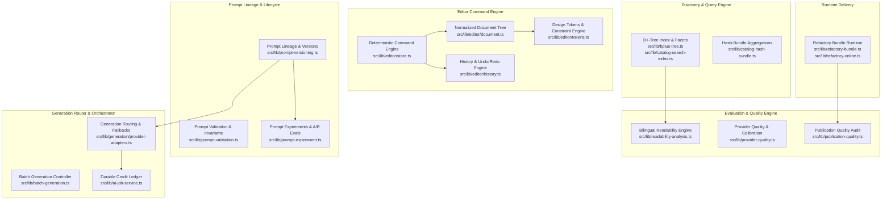

# Prompt Studio Custom Subsystems Architecture

This document details the architecture, design rationale, algorithms, invariants, and implementation contracts of **Prompt Studio's custom-engineered subsystems**. It establishes clear boundaries distinguishing repository-specific engineering differentiation from standard framework plumbing.

---

## Architecture Map of Custom Subsystems



---

## 1. B+-Tree Search Index and Faceted Navigation

### Problem & Constraints
Prompt Studio delivers low-latency search, pagination, and multi-facet filtering (model, category, price, style, tags) across thousands of prompt items without sending arbitrary query workloads to a remote database on every keystroke. Browser and edge execution require deterministic memory consumption, logarithmic search complexity, and ordered range scans.

### Algorithm & Data Model
- **Algorithm:** In-memory B+-Tree data structure of order $M$, where internal nodes store branching keys and leaf nodes store ordered keys and payload references, linked sequentially for range queries.
- **Data Model:**
  - Key: `string | number` composite index key (e.g. `locale:model:price:tag`).
  - Leaf payload: Item references (`string` ID or item index).
- **Files:**
  - [`src/lib/bplus-tree.ts`](../src/lib/bplus-tree.ts): Implementation of generic B+-Tree node splits, balance, key insertion, point search, and range traversal.
  - [`src/lib/catalog-search-index.ts`](../src/lib/catalog-search-index.ts): Catalog search indexing engine.
  - [`src/lib/catalog-facet-index.ts`](../src/lib/catalog-facet-index.ts): Multi-facet bucket generator.
  - [`src/lib/catalog-hash-bundle.ts`](../src/lib/catalog-hash-bundle.ts): Fast client-side hash bundles for instant tag aggregation.

### Invariants & Invariant Guarantees
1. All leaf nodes reside at the exact same tree depth.
2. Every node (except the root) maintains between $\lceil M/2 \rceil$ and $M$ children/keys.
3. Leaf nodes are linked in ascending key order for $O(\log N + K)$ range queries.
4. Mutation operations never mutate in-flight read snapshots.

### Failure Modes & Performance
- **Degradation:** Memory consumption scales linearly with item count ($O(N)$); search latency is strictly bounded ($O(\log N)$).
- **Fallback:** If index generation fails during prebuild, search falls back to linear scanning over static catalogs.

### Verification & Tests
- Unit tests: [`tests/unit/catalog-ranking.test.ts`](../tests/unit/catalog-ranking.test.ts)
- Test suite: `npm test`

---

## 2. Bilingual Readability and Quality Engine

### Problem & Constraints
Prompt Studio generates and hosts bilingual landing pages and copy in English and Spanish. Standard readability formulas (such as Flesch-Kincaid) are calibrated strictly for English syllable patterns and produce skewed, unreliable results when applied to Spanish text (which exhibits higher syllable counts per word).

### Algorithm & Data Model
- **Algorithm:** Dual-locale readability analyzer:
  - For English (`en`): Standard Flesch Reading Ease and Flesch-Kincaid Grade Level.
  - For Spanish (`es`): Fernández-Huerta and Flesch-Szigriszt algorithms calibrated for Spanish linguistic morphology and syllable hyphenation rules.
- **Metrics Computed:**
  - Sentence length distribution, complex words ratio, passive voice frequency, and reading ease score (0–100).
- **Files:**
  - [`src/lib/readability-analysis.ts`](../src/lib/readability-analysis.ts): Core multi-metric linguistic formula processor.
  - [`src/lib/landing-readability-badge.ts`](../src/lib/landing-readability-badge.ts): Quality badge threshold computation.
  - [`src/lib/landing-readability-store.ts`](../src/lib/landing-readability-store.ts): Readability snapshot and cache layer.

### Invariants
1. Syllable counter applies locale-specific vowel diphthong and triphthong rules according to the document's declared language.
2. Reading Ease score is normalized to $[0, 100]$.
3. Missing or empty text returns a neutral fallback score rather than `NaN` or runtime exceptions.

### Failure Modes & Performance
- Zero-length text triggers zero-division safeguards. Execution completes in $O(L)$ where $L$ is text length.

---

## 3. Refactory Bundle Runtime

### Problem & Constraints
Users can compose, customize, and export fully functional standalone 3D and interactive landing pages. The exported bundles must be fully self-contained (HTML, CSS, JavaScript, assets), execute without dependencies on external backend runtimes, and comply with strict Content Security Policies (CSP).

### Algorithm & Data Model
- **Manifest & Packager:**
  - Inlines or bundles assets into an isolated single-page distribution package.
  - Evaluates local paths, sandboxed scripts, and CSP compliant loaders.
- **Files:**
  - [`src/lib/refactory-bundle.ts`](../src/lib/refactory-bundle.ts): Bundle packager and structure validator.
  - [`src/lib/refactory-online.ts`](../src/lib/refactory-online.ts): Online demo extractor and CDN link resolution.
  - [`src/lib/zip-archive.ts`](../src/lib/zip-archive.ts): Zip packaging utility.

### Invariants
1. Exported bundles must include a valid, browser-executable `index.html`.
2. Assets referenced in manifests must resolve to local bundle paths or authorized remote storage.
3. No secret keys or non-public environment variables can be inlined into exported client bundles.

---

## 4. Multi-Provider Generation Router & Durable Credit Ledger

### Problem & Constraints
Generative workloads span multiple heterogeneous providers (OpenAI, Anthropic, Gemini, Runway, Fal, Kling, Luma). Requests must be routed based on requested capabilities, budget, quota availability, and automated retry policies with deterministic transaction reconciliation.

### Algorithm & Data Model
- **Routing Engine:**
  - Capability matrix matching (Text, Image, Video, Code).
  - Credit cost calculation via tier contracts prior to API invocation.
  - Atomic reservation and rollback ledger.
- **Files:**
  - [`src/lib/generation/provider-adapters.ts`](../src/lib/generation/provider-adapters.ts): Provider abstraction interface.
  - [`src/lib/generation-pricing.ts`](../src/lib/generation-pricing.ts): Credit requirement calculation rules.
  - [`src/lib/ai-job-service.ts`](../src/lib/ai-job-service.ts): Background job orchestration and status tracking.
  - [`src/models/AIGenerationJob.ts`](../src/models/AIGenerationJob.ts): Generation job state and outputs.
  - [`src/models/AICreditLedger.ts`](../src/models/AICreditLedger.ts): Immutable audit trail of credit debits/credits.

### Invariants
1. Credits are reserved before starting third-party dispatch.
2. Failed generations trigger automatic, idempotent credit refunds via the ledger.
3. Job status transitions follow a strict directed acyclic graph (`queued` &rarr; `processing` &rarr; `completed` | `failed`).

### Verification & Tests
- [`tests/unit/generation-pricing.test.ts`](../tests/unit/generation-pricing.test.ts)
- [`tests/unit/batch-generation.test.ts`](../tests/unit/batch-generation.test.ts)

---

## 5. Prompt Lineage, Versioning, and Evaluation Subsystem

### Problem & Constraints
Prompts in production are iterative engineering artifacts that require version control, reproducibility parameters (temperature, model, seed), and evaluation benchmarking across revisions.

### Algorithm & Data Model
- **Lineage Tree:**
  - Directed Acyclic Graph (DAG) linking prompt versions to parents (`parentVersionId`).
  - Evaluation record pairing human feedback, latency, token consumption, and automated quality metrics.
- **Files:**
  - [`src/lib/prompt-versioning.ts`](../src/lib/prompt-versioning.ts): Version mutation, diffing, and lineage traversal.
  - [`src/lib/prompt-validation.ts`](../src/lib/prompt-validation.ts): Structural constraints and placeholder syntax validation.
  - [`src/lib/prompt-experiment.ts`](../src/lib/prompt-experiment.ts): A/B comparison and statistical variance analysis.
  - [`src/models/PromptVersion.ts`](../src/models/PromptVersion.ts): Immutable version persistence schema.
  - [`src/models/PromptExperiment.ts`](../src/models/PromptExperiment.ts): Experiment evaluation runs.

### Invariants
1. Prompt versions are immutable once written; modifications produce a new version node with a `parentVersionId`.
2. Variable placeholders (e.g. `{{variable}}`) are strictly validated against declared input contracts.

### Verification & Tests
- [`tests/unit/prompt-versioning.test.ts`](../tests/unit/prompt-versioning.test.ts)
- [`tests/unit/prompt-validation.test.ts`](../tests/unit/prompt-validation.test.ts)
- [`tests/unit/prompt-experiment.test.ts`](../tests/unit/prompt-experiment.test.ts)

---

## 6. Visual Editor Command and Constraint Engine

### Problem & Constraints
The visual interface builder requires headless, deterministic execution independent of React's render loop, guaranteeing valid DOM component hierarchies and reversible actions.

### Architecture & Engine Components
- **Command Dispatcher:**
  - Actions dispatched as formal serializable command objects (`insert_node`, `update_style`, `move_node`, `remove_node`).
  - Invertible command pairs enabling robust undo/redo stacks.
- **Constraint Checker:**
  - Enforces component nesting rules (e.g. `button` cannot contain another `button`, `sidebar` must reside in page root).
- **Files:**
  - [`src/lib/editor/store.ts`](../src/lib/editor/store.ts): Headless command engine and reactive state.
  - [`src/lib/editor/document.ts`](../src/lib/editor/document.ts): Normalized tree data structure and schema migrations.
  - [`src/lib/editor/history.ts`](../src/lib/editor/history.ts): Bounded undo/redo transaction stack.
  - [`src/lib/editor/tokens.ts`](../src/lib/editor/tokens.ts): Design token constraint parser.
  - [`src/lib/editor/registry.ts`](../src/lib/editor/registry.ts): Component schema and hierarchy constraints.

### Invariants
1. Document trees are always cycle-free and serialize to valid JSON.
2. Undo followed by redo returns the document state to exact semantic equality.
3. Invalid structural mutations are rejected before modifying the active document state.

### Verification & Tests
- [`tests/unit/editor-core.test.ts`](../tests/unit/editor-core.test.ts)
- [`tests/unit/editor-ui-contracts.test.ts`](../tests/unit/editor-ui-contracts.test.ts)

---

## 7. Automated Architectural Link Verification

The integrity of links between architecture documentation and concrete source files is continuously verified by:

```bash
npm run docs:check-links
```

This ensures that architectural documentation and implementation stay synchronized across commits.
