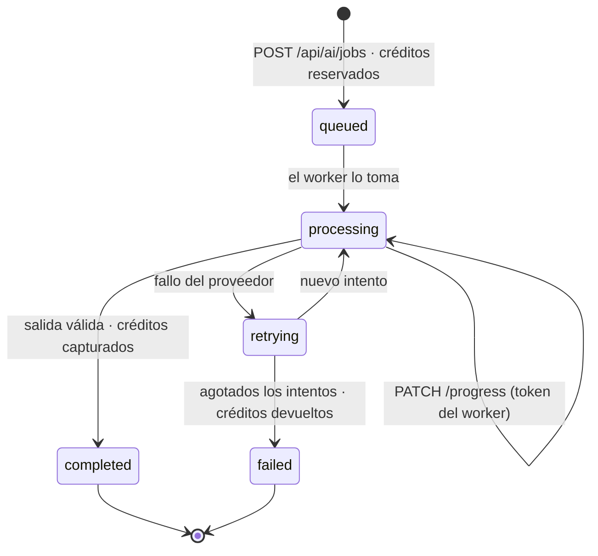

# Base de datos

MongoDB con Mongoose. **45 modelos** repartidos en 43 colecciones. Todo lo que
sigue está leído del código; los comandos para comprobarlo están en el §7.

---

## 1. Conexión

`src/lib/mongoose.ts` mantiene **una conexión cacheada en el objeto global**.

```ts
let cached = (global as any).mongoose;   // sobrevive al hot reload
```

No es una elegancia: en desarrollo, Next recarga los módulos en cada cambio, y
sin ese caché cada recarga abriría un pool nuevo hasta agotar las conexiones del
clúster. En producción, cada instancia serverless reutiliza su pool entre
invocaciones calientes.

Opciones relevantes:

| Opción | Valor | Por qué |
|---|---|---|
| `maxPoolSize` | 10 | Techo por instancia; en serverless se multiplica por el número de instancias vivas |
| `bufferCommands` | `false` | Sin esto, una consulta lanzada antes de conectar se queda encolada y falla por timeout en lugar de fallar rápido |

Toda ruta que toca datos llama a `connectToDatabase()` antes de la primera
consulta.

---

## 2. Dominios

| Dominio | Modelos | Colecciones principales |
|---|---|---|
| **Generación con IA** | 11 | `ai_generation_jobs`, `ai_credit_ledger`, `ai_credit_accounts`, `batch_generations`, `output_contracts`, `evaluation_suites`, `human_evaluations`, `prompt_versions`, `prompt_experiments`, `model_regressions` |
| **Afiliados** | 7 | `affiliate_applications`, `affiliate_clicks`, `affiliate_sales`, `affiliate_payout_accounts`, `affiliate_daily_stats`, `affiliate_user_stats`, `affiliate_referral_stats` |
| **Comercio** | 6 | `component_purchases`, `credit_purchases`, `marketplace_listings`, `marketplace_sales`, `component_libraries`, `landing_publications` |
| **Usuario** | 7 | `user_profiles`, `saved_items`, `user_interests`, `cookieconsents`, `useractivities` |
| **Proyectos** | 6 | `creative_projects`, `campaign_workflows`, `brand_kits`, `project_client_links`, `project_funnel_events`, `publication_quality_audits` |
| **Otros** | 8 | `observability_events`, `catalog_likes`, `catalog_engagements`, `asset_provenance`, `product_reviews`, `editor_projects`, `feature_experiments`, `feature_assignments` |

---

## 3. Tres modelos, una colección: `user_profiles`

`NewUser`, `RegisteredUser` y `UserProfile` escriben en la **misma colección**.
Es deliberado, y la razón está en `/api/sync-resend`: recorre la colección entera
para sincronizar con Resend tanto a los clientes como a los *leads* que dejaron
su correo en una descarga gratuita sin crear cuenta.

**El fallo que esto provocó, y cómo se corrigió.** Un lead se inserta sin
`userId`. MongoDB interpreta el campo ausente como `null`, y con un índice único
normal **solo el primer lead entra**: todos los siguientes fallan con `E11000`.
Ocurría en producción y hacía que `/api/new-users` devolviera 500 en cada captura
de correo.

La corrección es un **índice único parcial** (`src/models/UserProfile.ts:46`):

```ts
{ unique: true, partialFilterExpression: { userId: { $type: 'string' } } }
```

La unicidad solo aplica a los documentos cuyo `userId` es una cadena, es decir, a
los perfiles reales; los leads sin `userId` quedan fuera del índice y pueden ser
muchos.

> Si algún día se separan las colecciones, hay que cambiar `/api/sync-resend` a
> la vez: hoy depende de que ambos tipos convivan.

---

## 4. Índices

| Modelo | Índices | Únicos | Para qué |
|---|---|---|---|
| `ObservabilityEvent` | 3 | 0 | `{route, productId, createdAt}` y `{category, name, createdAt}` para los agregados del panel |
| `AffiliateSale` | 1 | 2 | Búsqueda por afiliado y por estado de liquidación |
| `MarketplaceListing` | 1 | 1 | Cola de revisión por estado y antigüedad |
| `SavedItem` | 2 | 1 | Único `{userId, itemKind, itemId}`: dos clics simultáneos no pueden duplicar |
| `ComponentLibrary` | 0 | 1 | `userId` único: la biblioteca es una por cuenta y el upsert depende de ello |
| `AICreditLedger` | 1 | 1 | Movimientos por trabajo |
| `EditorProject` | 2 | 0 | `{userId, updatedAt}` para listar por recencia |

**Patrón general**: donde hay una operación idempotente —guardar un favorito,
registrar una compra— hay un índice único que la hace idempotente **en la base de
datos**, no solo en el código. Dos peticiones simultáneas no pueden crear dos
filas.

---

## 5. Retención

Solo una colección caduca sola:

```ts
createdAt: { type: Date, default: Date.now, index: true, expires: 60 * 60 * 24 * 90 }
```

`observability_events` borra cada documento a los **90 días**. Es una decisión
con consecuencia: no habrá series históricas más largas de tres meses, así que
cualquier comparación anual exige archivar antes.

El resto de colecciones crecen sin límite. Las de más riesgo son
`affiliate_clicks` y `catalog_engagements`, que registran un documento por
interacción.

---

## 6. Ciclo de vida del trabajo de IA

Es el flujo con más estados del sistema y el que más cuidado exige, porque mueve
dinero.



Estados de `AIGenerationJob`: `queued`, `processing`, `retrying`, `completed`,
`failed`. Estados del crédito asociado: `reserved`, `captured`, `refunded`.

**La invariante que sostiene el sistema**: ningún trabajo termina sin que su
crédito pase de `reserved` a `captured` o a `refunded`. Un trabajo fallido
devuelve lo reservado, y el usuario recibe un correo que lo dice con el número de
intentos.

---

## 7. Cómo comprobar lo anterior

```bash
# Colecciones, índices y TTL por modelo
node -e "
const fs=require('fs');
for(const f of fs.readdirSync('src/models').filter(x=>x.endsWith('.ts'))){
  const t=fs.readFileSync('src/models/'+f,'utf8');
  const col=(t.match(/mongoose\.model<[^>]*>\([^,]+,\s*\w+,\s*'([^']+)'/)||[])[1]||'(por defecto)';
  console.log(f.replace('.ts',''), col, 'índices:'+(t.match(/\.index\(/g)||[]).length, 'TTL:'+(t.match(/expires:/g)||[]).length);
}"

# Modelos que comparten colección
grep -l "'user_profiles'" src/models/*.ts

# Estados del trabajo de IA
grep -oE "enum: ?\[[^]]*\]" src/models/AIGenerationJob.ts
```

Modelo campo a campo: [dm.md](dm.md). Decisiones de arquitectura que lo
explican: [ARCHITECTURE.md](ARCHITECTURE.md).
