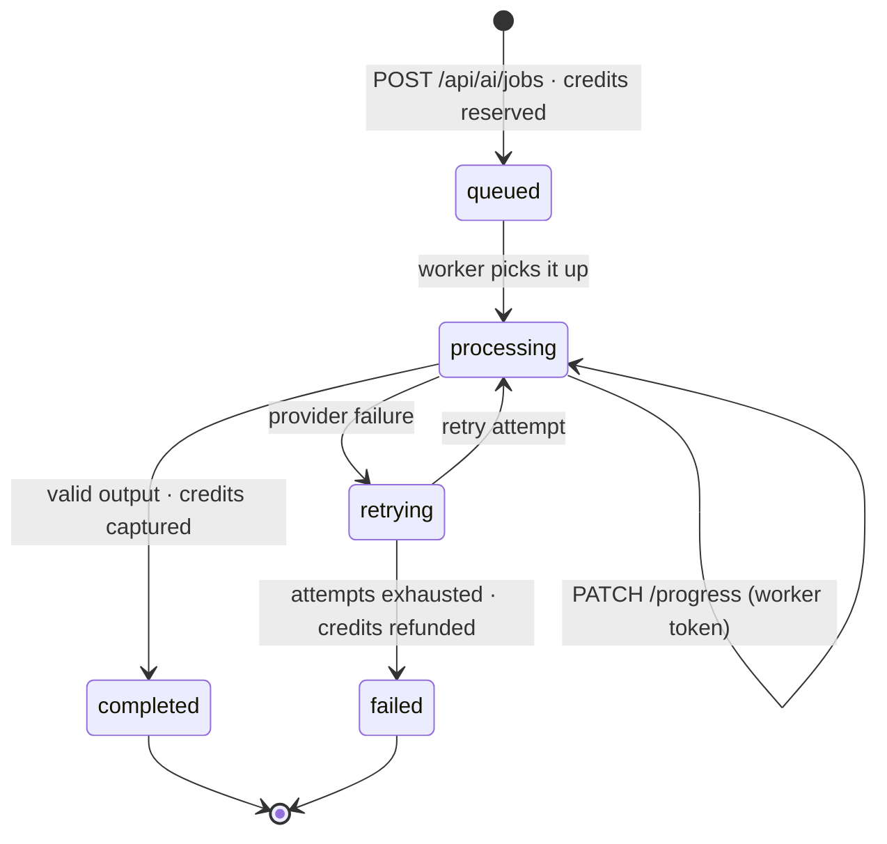

# Database

MongoDB with Mongoose. **45 models** spread across 43 collections. Everything below is read directly from code; the commands to verify it are in §7.

---

## 1. Connection

[`src/lib/mongoose.ts`](../src/lib/mongoose.ts) maintains **a cached connection on the global object**.

```ts
let cached = (global as any).mongoose;   // survives hot reload
```

This is not just for elegance: in development, Next.js hot-reloads modules on every change, and without this cache every reload would open a new pool until running out of cluster connections. In production, each serverless instance reuses its pool between warm invocations.

Relevant options:

| Option | Value | Why |
|---|---|---|
| `maxPoolSize` | 10 | Cap per instance; in serverless, it multiplies by the number of live instances |
| `bufferCommands` | `false` | Without this, a query launched before connecting stays queued and times out instead of failing fast |

Every route touching data calls `connectToDatabase()` before the first query.

---

## 2. Domains

| Domain | Models | Main collections |
|---|---|---|
| **AI Generation** | 11 | [`AICreditAccount`](../src/models/AICreditAccount.ts), [`AICreditLedger`](../src/models/AICreditLedger.ts), [`AIGenerationFeedback`](../src/models/AIGenerationFeedback.ts), [`AIGenerationJob`](../src/models/AIGenerationJob.ts), [`BatchGeneration`](../src/models/BatchGeneration.ts), [`EvaluationSuite`](../src/models/EvaluationSuite.ts), [`HumanEvaluation`](../src/models/HumanEvaluation.ts), [`ModelRegression`](../src/models/ModelRegression.ts), [`OutputContract`](../src/models/OutputContract.ts), [`PromptExperiment`](../src/models/PromptExperiment.ts), [`PromptVersion`](../src/models/PromptVersion.ts) |
| **Affiliates** | 7 | [`AffiliateApplication`](../src/models/AffiliateApplication.ts), [`AffiliateClick`](../src/models/AffiliateClick.ts), [`AffiliateDailyStats`](../src/models/AffiliateDailyStats.ts), [`AffiliatePayoutAccount`](../src/models/AffiliatePayoutAccount.ts), [`AffiliateReferralStats`](../src/models/AffiliateReferralStats.ts), [`AffiliateSale`](../src/models/AffiliateSale.ts), [`AffiliateUserStats`](../src/models/AffiliateUserStats.ts) |
| **Commerce** | 6 | [`ComponentLibrary`](../src/models/ComponentLibrary.ts), [`ComponentPurchase`](../src/models/ComponentPurchase.ts), [`CreditPurchase`](../src/models/CreditPurchase.ts), [`LandingPublication`](../src/models/LandingPublication.ts), [`MarketplaceListing`](../src/models/MarketplaceListing.ts), [`MarketplaceSale`](../src/models/MarketplaceSale.ts) |
| **User** | 7 | [`CookieConsent`](../src/models/CookieConsent.ts), [`NewUser`](../src/models/NewUser.ts), [`RegisteredUser`](../src/models/RegisteredUser.ts), [`SavedItem`](../src/models/SavedItem.ts), [`UserActivity`](../src/models/UserActivity.ts), [`UserInterest`](../src/models/UserInterest.ts), [`UserProfile`](../src/models/UserProfile.ts) |
| **Projects** | 6 | [`BrandKit`](../src/models/BrandKit.ts), [`CampaignWorkflow`](../src/models/CampaignWorkflow.ts), [`CreativeProject`](../src/models/CreativeProject.ts), [`ProjectClientLink`](../src/models/ProjectClientLink.ts), [`ProjectFunnelEvent`](../src/models/ProjectFunnelEvent.ts), [`PublicationQualityAudit`](../src/models/PublicationQualityAudit.ts) |
| **Others** | 8 | [`AssetProvenance`](../src/models/AssetProvenance.ts), [`CatalogEngagement`](../src/models/CatalogEngagement.ts), [`CatalogLike`](../src/models/CatalogLike.ts), [`EditorProject`](../src/models/EditorProject.ts), [`FeatureAssignment`](../src/models/FeatureAssignment.ts), [`FeatureExperiment`](../src/models/FeatureExperiment.ts), [`ObservabilityEvent`](../src/models/ObservabilityEvent.ts), [`ProductReview`](../src/models/ProductReview.ts) |

---

## 3. Three models, one collection: `user_profiles`

[`NewUser`](../src/models/NewUser.ts), [`RegisteredUser`](../src/models/RegisteredUser.ts), and [`UserProfile`](../src/models/UserProfile.ts) write to the **same collection**. It is deliberate, and the reason lies in [`/api/sync-resend`](../src/app/api/sync-resend/route.ts): it iterates through the entire collection to sync with Resend both customers and leads who left their email in a free download without creating an account.

**The bug this caused, and how it was fixed.** A lead is inserted without `userId`. MongoDB interprets the missing field as `null`, and with a standard unique index **only the first lead gets in**: all subsequent ones fail with `E11000`. It was happening in production, causing `/api/new-users` to return 500 on every email capture.

The fix is a **partial unique index** ([`src/models/UserProfile.ts:46`](../src/models/UserProfile.ts#L46)):

```ts
{ unique: true, partialFilterExpression: { userId: { $type: 'string' } } }
```

Uniqueness only applies to documents whose `userId` is a string, i.e., actual profiles; leads without a `userId` are excluded from the index and can be numerous.

> If the collections are ever split in the future, `/api/sync-resend` must be updated at the same time: today it depends on both types coexisting.

---

## 4. Indexes

| Model | Indexes | Unique | Purpose |
|---|---|---|---|
| [`ObservabilityEvent`](../src/models/ObservabilityEvent.ts) | 3 | 0 | `{route, productId, createdAt}` and `{category, name, createdAt}` for dashboard aggregates |
| [`AffiliateSale`](../src/models/AffiliateSale.ts) | 1 | 2 | Lookup by affiliate and by payout status |
| [`MarketplaceListing`](../src/models/MarketplaceListing.ts) | 1 | 1 | Review queue by status and age |
| [`SavedItem`](../src/models/SavedItem.ts) | 2 | 1 | Unique `{userId, itemKind, itemId}`: two simultaneous clicks cannot duplicate |
| [`ComponentLibrary`](../src/models/ComponentLibrary.ts) | 0 | 1 | Unique `userId`: there is one library per account and upserting depends on it |
| [`AICreditLedger`](../src/models/AICreditLedger.ts) | 1 | 1 | Ledger entries by job |
| [`EditorProject`](../src/models/EditorProject.ts) | 2 | 0 | `{userId, updatedAt}` to list by recency |

**General pattern**: wherever there is an idempotent operation—saving a favorite, recording a purchase—there is a unique index that enforces idempotency **in the database**, not just in code. Two concurrent requests cannot create two rows.

---

## 5. Retention

Only one collection auto-expires:

```ts
createdAt: { type: Date, default: Date.now, index: true, expires: 60 * 60 * 24 * 90 }
```

`observability_events` deletes each document after **90 days**. This is a consequential decision: there will be no historical time series longer than three months, so any annual comparison requires archiving beforehand.

The remaining collections grow indefinitely. The highest risk ones are `affiliate_clicks` and `catalog_engagements`, which record one document per interaction.

---

## 6. AI Job Lifecycle

This is the system flow with the most states and requires the most care, as it handles money.



States of `AIGenerationJob`: `queued`, `processing`, `retrying`, `completed`, `failed`. States of the associated credit: `reserved`, `captured`, `refunded`.

**The invariant holding the system together**: no job finishes without its credit transitioning from `reserved` to `captured` or `refunded`. A failed job refunds the reserved credits, and the user receives an email indicating this along with the number of attempts.

---

## 7. How to Verify the Above

```bash
# Collections, indexes, and TTL per model
node -e "
const fs=require('fs');
for(const f of fs.readdirSync('src/models').filter(x=>x.endsWith('.ts'))){
  const t=fs.readFileSync('src/models/'+f,'utf8');
  const col=(t.match(/mongoose\.model<[^>]*>\([^,]+,\s*\w+,\s*'([^']+)'/)||[])[1]||'(default)';
  console.log(f.replace('.ts',''), col, 'indexes:'+(t.match(/\.index\(/g)||[]).length, 'TTL:'+(t.match(/expires:/g)||[]).length);
}"

# Models sharing a collection
grep -l "'user_profiles'" src/models/*.ts

# AI job states
grep -oE "enum: ?\[[^]]*\]" src/models/AIGenerationJob.ts
```

Model field by field: [dm.md](dm.md). Architecture decisions explaining it: [ARCHITECTURE.md](ARCHITECTURE.md).