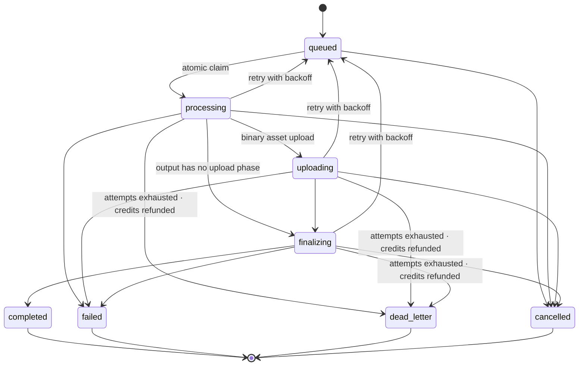

# Canonical GenerationJob state machine

`GenerationJob` is the durable contract shared by image, video and web
generation. The typed source of truth is
[`generation-job-state.ts`](../../src/lib/generation-job-state.ts); MongoDB
ownership and transitions live in
[`generation-job-state-server.ts`](../../src/lib/generation-job-state-server.ts).

## Canonical contract

Every serialized job exposes:

| Area | Fields |
|---|---|
| Identity | `id`, `userId`, `type`, `correlationId` |
| Provider | `provider`, `model`, `providerRequestId` |
| Lifecycle | `status`, `attempt`, timestamps |
| Cost | `estimatedCredits`, `actualCredits` |
| Output | `assetRef`, `outputRef` |
| Failure | `errorCategory` |

`type` is always `image`, `video` or `web`. Existing MongoDB documents keep
their `kind` field; `project` is mapped to `web` at the API boundary. Existing
`retrying` records remain readable and map to canonical `queued`. This is an
additive compatibility layer and requires no destructive migration.

## Legal transitions



`completed`, `failed`, `dead_letter` and `cancelled` are terminal. A manual retry
therefore creates a new job with `input.retryOfJobId`; it does not reopen the old
job or reuse its credit-ledger/provider idempotency identity. `dead_letter` differs
from `failed` in that it waits for an operator: only
`POST /api/admin/ai/jobs/[id]/reprocess` reopens one, and it does so at most once
per job.

## Atomic ownership

Claims and transitions use one MongoDB `findOneAndUpdate`, never a read followed
by an unconditional save:

1. A claim writes `lockOwner`, random `lockToken`, `lockAcquiredAt` and
   `leaseExpiresAt`, changes the state to `processing`, and increments `attempt`.
2. Every worker transition filters by `_id`, expected source state and the same
   `lockToken`.
3. A stale or duplicate transition updates no document and raises
   `GenerationJobOwnershipError`.
4. Requeue and terminal transitions release all lock fields atomically.
5. An expired lease permits another invocation to reclaim an abandoned active
   job; provider idempotency prevents duplicate upstream work.

## Current API compatibility

`serializeAIJob` returns both the canonical fields and the legacy aliases used
by existing clients (`kind`, `creditCost`, `attempts`). The dashboard recognizes
all canonical states. The worker progress endpoint accepts active
`processing`, `uploading` and `finalizing` jobs.

The current processor records `finalizing` before credit capture and terminal
completion. The `uploading` state is part of the shared contract for providers
that report an explicit asset-upload phase; wiring provider callbacks into that
phase belongs with real progress reporting. Worker progress writes must echo the
per-attempt `ownershipToken`; stale attempts receive a conflict instead of
overwriting the current owner.

## Verification

```bash
node --import tsx --test tests/unit/generation-job-state-machine.test.ts
npm run typecheck
```
