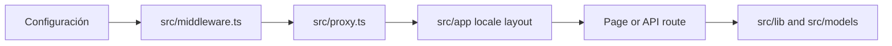

# DOC-007 — Entry points de runtime

**Fecha:** 2026-09-15  
**Backlog:** [DOC-007](https://github.com/jggjosue/prompt-studio/issues/39) · [backlog principal](https://github.com/jggjosue/prompt-studio/issues/32)

## Cuándo usar este mapa

Usa este documento antes de cambiar el arranque de la aplicación, routing,
providers globales, configuración de build o bootstrap de una integración. Cada
fila enlaza el archivo que ejecuta el comportamiento; las guías de dominio
explican sus invariantes.

## Orden de arranque de una solicitud

1. Next carga [`next.config.ts`](../../next.config.ts), que registra
   `next-intl`, headers, imágenes, aliases de build y restricciones de runtime.
2. Next invoca [`src/middleware.ts`](../../src/middleware.ts), el entry point
   que reexporta el proxy.
3. [`src/proxy.ts`](../../src/proxy.ts) aplica protección de Clerk, decisiones
   de locale, redirects canónicos, bloqueo del catálogo fuente y headers edge.
4. Para una página localizada, el proxy reescribe internamente a
   [`src/app/[locale]/layout.tsx`](<../../src/app/[locale]/layout.tsx>), que
   valida el locale y monta los providers globales.
5. La página o handler entrega la feature; la lógica compartida vive en
   [`src/lib`](../../src/lib) y los contratos persistentes en
   [`src/models`](../../src/models).

Las API no pasan por el gate del dashboard: cada handler en
[`src/app/api`](../../src/app/api) debe validar su propia autorización. La
matriz verificable está en [API_ACCESS.md](../API_ACCESS.md).

## Índice de entry points

| Área | Archivo(s) | Responsabilidad y cambio seguro |
|---|---|---|
| Configuración de runtime | [`package.json`](../../package.json), [`next.config.ts`](../../next.config.ts), [`tsconfig.json`](../../tsconfig.json), [`vercel.json`](../../vercel.json), [`.env.example`](../../.env.example) | Define scripts, compilación, headers, deployment y el contrato de variables. Si cambia una variable, actualiza `.env.example` y ejecuta `npm run verify:env-example`. |
| Borde de request | [`src/middleware.ts`](../../src/middleware.ts), [`src/proxy.ts`](../../src/proxy.ts) | Punto de entrada de Next y lógica de routing/seguridad. Para cambios de matcher, redirects o rutas protegidas sigue el [Authentication playbook](../playbooks/AUTHENTICATION.md). |
| Locale y mensajes | [`src/i18n/config.ts`](../../src/i18n/config.ts), [`src/i18n/detect-locale.ts`](../../src/i18n/detect-locale.ts), [`src/i18n/request.ts`](../../src/i18n/request.ts) | Define locales permitidos, detección y carga de mensajes. No volver a leer headers o cookies desde el layout: impediría el prerender. |
| Layout y providers | [`src/app/[locale]/layout.tsx`](<../../src/app/[locale]/layout.tsx>), [`src/lib/clerk-config.ts`](../../src/lib/clerk-config.ts), [`src/components/subscription-status-provider.tsx`](../../src/components/subscription-status-provider.tsx), [`src/components/saved-items-provider.tsx`](../../src/components/saved-items-provider.tsx), [`src/components/theme-provider.tsx`](../../src/components/theme-provider.tsx) | Compone Clerk, i18n, suscripción, elementos guardados, tema y UI global. Mantén el orden de providers y `setRequestLocale(locale)` al modificarlo. |
| Páginas | [`src/app/[locale]`](<../../src/app/[locale]>), [`src/app/[locale]/page.tsx`](<../../src/app/[locale]/page.tsx>), [`src/app/[locale]/dashboard/layout.tsx`](<../../src/app/[locale]/dashboard/layout.tsx>) | Entry points del App Router para la interfaz pública y dashboard. La página raíz prepara el feed; los clientes y componentes deben permanecer en el dominio de la feature. |
| API y webhooks | [`src/app/api`](../../src/app/api), [`src/app/api/ai/jobs/route.ts`](../../src/app/api/ai/jobs/route.ts), [`src/app/api/webhooks/stripe/route.ts`](../../src/app/api/webhooks/stripe/route.ts), [`src/app/api/webhooks/clerk/route.ts`](../../src/app/api/webhooks/clerk/route.ts) | Entrada HTTP de operaciones de producto e integraciones. Añade o actualiza el mecanismo de acceso en la matriz antes de exponer una ruta. |
| Server actions | [`src/app/actions.ts`](../../src/app/actions.ts), [`src/app/actions`](../../src/app/actions) | Entry points `use server` usados por páginas y formularios. Deben validar entrada y autorización antes de invocar servicios. |
| Metadatos y assets globales | [`src/app/robots.ts`](../../src/app/robots.ts), [`src/app/sitemap.ts`](../../src/app/sitemap.ts), [`src/app/fonts.ts`](../../src/app/fonts.ts), [`src/app/globals.css`](../../src/app/globals.css) | Define robots, sitemap, fuentes y estilos que entran en el árbol raíz. Verifica el sitemap y build cuando cambies rutas públicas. |
| IA y observabilidad de runtime | [`src/ai/genkit.ts`](../../src/ai/genkit.ts), [`src/ai`](../../src/ai), [`src/instrumentation.ts`](../../src/instrumentation.ts) | Inicializa Genkit y hooks de observabilidad; consulta [AI_ARCHITECTURE.md](../AI_ARCHITECTURE.md) antes de cambiar el procesamiento de jobs. |

## Checklist para cambios transversales

1. Identifica el entry point de la fila anterior y sus consumidores directos.
2. Si el cambio toca routing, autenticación o headers, ejecuta los contratos
   del [Authentication playbook](../playbooks/AUTHENTICATION.md).
3. Si añade una ruta API, actualiza y regenera [API_ACCESS.md](../API_ACCESS.md).
4. Si cambia configuración de build o entorno, ejecuta `npm run validate` antes
   de desplegar.
5. Mantén el mapa al día cuando aparezca otro entry point global.

## Relación con otros mapas

- [DOC-005 — Documentation to Code Map](DOCUMENTATION_TO_CODE_MAP.md) navega
  por subsistema documentado.
- [DOC-004 — Architecture](../ARCHITECTURE.md) explica las capas y sus límites.
- [DOC-003 — High-Impact Source Priorities](HIGH_IMPACT_SOURCE_PRIORITIES.md)
  define qué contratos merecen documentación explicativa primero.
