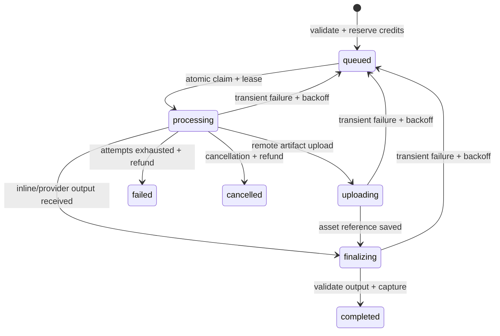

# AI Generation and Genkit Playbook

Use this playbook when adding a provider, changing job states, credit charging, retries, output validation, or the external worker contract.

## Two execution paths

- Interactive generation uses the client registry in [`provider-adapters.ts`](../../src/lib/generation/provider-adapters.ts), which delegates to server actions.
- Durable jobs enter through [`POST /api/ai/jobs`](../../src/app/api/ai/jobs/route.ts), are claimed by [`/api/ai/jobs/process`](../../src/app/api/ai/jobs/process/route.ts), and run through [`runAIJob`](../../src/lib/ai-job-runner.ts).
- Google image jobs may execute locally through the Genkit flow in [`generate-image.ts`](../../src/ai/flows/generate-image.ts); other jobs require the external worker.



## Sources of truth

- Job/provider compatibility and credit cost: [`ai-job-config.ts`](../../src/lib/ai-job-config.ts)
- Reserve, capture, refund, and notification: [`ai-job-service.ts`](../../src/lib/ai-job-service.ts)
- Worker request, timeout, and response size: [`ai-job-runner.ts`](../../src/lib/ai-job-runner.ts)
- Job state and unique idempotency key: [`AIGenerationJob.ts`](../../src/models/AIGenerationJob.ts)
- Canonical states, transitions, and compatibility mapping: [`generation-job-state.ts`](../../src/lib/generation-job-state.ts)
- Atomic claim, ownership, and transitions: [`generation-job-state-server.ts`](../../src/lib/generation-job-state-server.ts)
- Output rules and repair: [`output-contract.ts`](../../src/lib/output-contract.ts)
- Full design rationale: [`AI_ARCHITECTURE.md`](../AI_ARCHITECTURE.md)

## Invariants

1. Reserve credits before queueing work; capture only after a valid result.
2. Every terminal failure refunds a still-reserved balance.
3. `{userId, idempotencyKey}` and `{jobId, operation}` remain unique.
4. Workers receive `Idempotency-Key`, time out before the route limit, and return at most 2 MB.
5. Provider output must satisfy its output contract before the job completes.

## Safe change procedure

1. Add the provider or kind to [`ai-job-config.ts`](../../src/lib/ai-job-config.ts).
2. Update the adapter/runner without bypassing the credit lifecycle.
3. Keep worker calls idempotent across retries.
4. Add a deterministic test case; do not require a paid provider in CI.
5. Check observability events for completed, requeued, failed, and cancelled paths.

## Verification

```bash
node --import tsx --test tests/unit/output-contract.test.ts
node --import tsx --test tests/unit/credit-topup.test.ts
npm run typecheck
```
