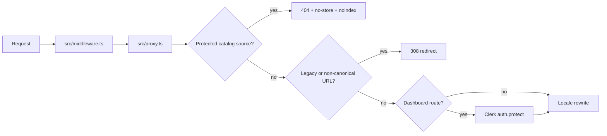

# Authentication, Middleware, and Proxy Playbook

Use this playbook when changing route protection, locale handling, redirects, Clerk synchronization, or security headers.

## Request flow



- [`src/middleware.ts`](../../src/middleware.ts) is the Next.js entry point and re-exports the proxy.
- [`src/proxy.ts`](../../src/proxy.ts) owns Clerk middleware, protected dashboard routes, locale rewrites, canonical redirects, catalog-source blocking, and edge headers.
- API routes do not inherit dashboard authorization. Each handler must enforce its own mechanism; see [`docs/API_ACCESS.md`](../API_ACCESS.md).
- Clerk lifecycle events enter through the signature-verified [`Clerk webhook`](../../src/app/api/webhooks/clerk/route.ts).

## Invariants

1. `/dashboard/**` requires `auth.protect()`.
2. API authorization stays inside each route; never trust a page-level gate.
3. Raw catalog JSON and compressed variants return 404 and must not redirect.
4. Redirects preserve the query string because affiliate attribution uses `?ref=`.
5. Locale rewrites skip APIs, Next internals, Clerk assets, static files, and SEO metadata.
6. Webhooks authenticate with provider signatures, not browser sessions.

## Safe change procedure

1. Add or change matchers in [`src/proxy.ts`](../../src/proxy.ts), keeping the exported `config` in sync.
2. For a new API route, add one recognized mechanism or an explicit public justification in [`build-route-access-matrix.mjs`](../../scripts/mjs/build-route-access-matrix.mjs).
3. Regenerate the access matrix with `node scripts/mjs/build-route-access-matrix.mjs`.
4. Verify redirects retain search parameters and do not create locale loops.
5. Exercise the security contract tests before deployment.

## Failure triage

| Symptom | First checks |
|---|---|
| Dashboard returns 401/redirect loop | Clerk keys, proxy matcher, `auth.protect()` branch |
| `/_next/image` returns 404 | `skipsLocale()` and middleware matcher |
| API unexpectedly public | Route handler plus [`API_ACCESS.md`](../API_ACCESS.md) |
| Clerk users do not sync | webhook secret, Svix headers, [`webhooks/clerk`](../../src/app/api/webhooks/clerk/route.ts) logs |

## Verification

```bash
node --import tsx --test tests/unit/route-access-matrix.test.ts
node --import tsx --test tests/unit/security-and-limits.test.ts
node --import tsx --test tests/unit/api-security-contracts.test.ts
```

