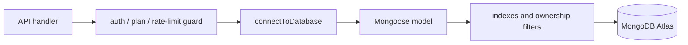

# Data and Persistence Playbook

Use this playbook when adding a MongoDB model, changing indexes, modifying ownership filters, or investigating connection and consistency failures.

## Data flow

API handlers call [`connectToDatabase`](../../src/lib/mongoose.ts), validate identity and input, then query a model under [`src/models`](../../src/models/). Firebase configuration in [`src/lib/firebase.ts`](../../src/lib/firebase.ts) is separate from the server-side Mongoose persistence path.



## Connection contract

[`src/lib/mongoose.ts`](../../src/lib/mongoose.ts) caches the connection and in-flight promise on `global`, caps each serverless pool at 10, releases idle connections after 30 seconds, and fails server selection after 5 seconds. If connection creation fails, the cached promise is cleared so a later request can retry.

## Model contract

- Declare collection names explicitly to avoid Mongoose pluralization surprises.
- Put concurrency guarantees in indexes, not only JavaScript checks.
- Include `userId` in update/delete filters for account-owned records.
- Use partial unique indexes when legacy or lead records may omit the unique field.
- Bound embedded arrays and documents to prevent unbounded record growth.

Examples: [`UserProfile.ts`](../../src/models/UserProfile.ts), [`AIGenerationJob.ts`](../../src/models/AIGenerationJob.ts), [`AICreditLedger.ts`](../../src/models/AICreditLedger.ts), and [`EditorProject.ts`](../../src/models/EditorProject.ts). The collection inventory and index rationale live in [`DATABASE.md`](../DATABASE.md).

## Safe change procedure

1. Define the schema, collection name, indexes, and ownership field.
2. Decide how existing documents migrate before making a field required or unique.
3. Make writes retry-safe with an upsert or unique operation key where appropriate.
4. Ensure API responses do not expose internal fields or another user's records.
5. Test duplicate, concurrent, missing-field, and unauthorized cases.

## Failure triage

| Symptom | First checks |
|---|---|
| `E11000` | index definition, null/missing legacy fields, idempotency key |
| Connection timeout | `MONGODB_URI`, Atlas allowlist, pool saturation |
| Cross-account data | missing `userId` in read/update/delete filter |
| Growing documents | embedded history/list without `$slice` or limit |

## Verification

```bash
npm run typecheck
node --import tsx --test tests/unit/security-and-limits.test.ts
node --import tsx --test tests/unit/api-security-contracts.test.ts
```

