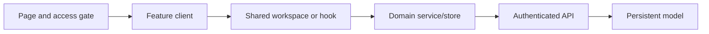

# Componentes de features prioritarias

**Backlog:** [DOC-009](https://github.com/jggjosue/prompt-studio/issues/41) · [backlog principal](https://github.com/jggjosue/prompt-studio/issues/32)

Este mapa identifica los componentes que componen las features de mayor impacto
y las dependencias que no se deben ignorar al modificarlos. Es un mapa de
ownership, no un inventario de cada control visual.

## Features y dependencias

| Feature | Entrada y componentes | Hooks y servicios | Persistencia, acceso y contrato |
|---|---|---|---|
| Component Builder | [Page](<../../src/app/[locale]/component-builder/page.tsx>) → [editor client](<../../src/app/[locale]/component-builder/component-builder-editor-client.tsx>) → [`EditorWorkspace`](../../src/components/editor/editor-workspace.tsx) → [`EditorShell`](../../src/components/editor/editor-shell.tsx) | [`use-editor-autosave`](../../src/hooks/use-editor-autosave.ts), [`src/lib/editor`](../../src/lib/editor) | [`server-subscription-status`](../../src/lib/server-subscription-status.ts), [`/api/editor/projects`](../../src/app/api/editor/projects/route.ts), [`EditorProject`](../../src/models/EditorProject.ts) |
| Page Composer | [Page](<../../src/app/[locale]/page-composer/page.tsx>) → [editor client](<../../src/app/[locale]/page-composer/page-composer-editor-client.tsx>) → [`EditorWorkspace`](../../src/components/editor/editor-workspace.tsx) | [`createDocument`](../../src/lib/editor/document.ts), [`createNode`](../../src/lib/editor/document.ts), [`use-editor-autosave`](../../src/hooks/use-editor-autosave.ts) | [`server-subscription-status`](../../src/lib/server-subscription-status.ts), [`/api/editor/projects`](../../src/app/api/editor/projects/route.ts), [`EditorProject`](../../src/models/EditorProject.ts) |
| Núcleo de editor visual | [`EditorShell`](../../src/components/editor/editor-shell.tsx), [`ComponentsPanel`](../../src/components/editor/components-panel.tsx), [`EditorCanvas`](../../src/components/editor/editor-canvas.tsx), [`LayersPanel`](../../src/components/editor/layers-panel.tsx), [`InspectorPanel`](../../src/components/editor/inspector-panel.tsx), [`NodeView`](../../src/components/editor/node-view.tsx) | [`registry`](../../src/lib/editor/registry.ts), [`document`](../../src/lib/editor/document.ts), [`store`](../../src/lib/editor/store.ts), [`history`](../../src/lib/editor/history.ts), [`drag`](../../src/lib/editor/drag.ts) | El documento normalizado y las reglas de nesting son el contrato; consulta [Visual Editor playbook](VISUAL_EDITOR.md) antes de cambiar cualquiera de estas piezas. |
| Biblioteca de componentes | [`ComponentLibraryActions`](../../src/components/component-library-actions.tsx), [composición canvas](../../src/components/builder/composition-canvas.tsx), [composición panel](../../src/components/builder/composition-panel.tsx) | [`use-component-library`](../../src/hooks/use-component-library.ts), [`use-component-catalog-data`](../../src/hooks/use-component-catalog-data.ts), [`builder-blocks`](../../src/lib/builder-blocks.ts) | [`/api/component-library`](../../src/app/api/component-library/route.ts), [export endpoint](../../src/app/api/component-library/export/route.ts), [`ComponentLibrary`](../../src/models/ComponentLibrary.ts) |
| Generación interactiva | [Image client](<../../src/app/[locale]/generate-images/prompt-editor-client.tsx>), [Video client](<../../src/app/[locale]/generate-videos/generate-videos-client.tsx>), [Web client](<../../src/app/[locale]/generate-webs/generate-webs-client.tsx>), [feedback](../../src/components/generation/generation-feedback.tsx) | [`use-generation-editor`](../../src/hooks/use-generation-editor.ts), [`provider-adapters`](../../src/lib/generation/provider-adapters.ts) | [`src/app/actions.ts`](../../src/app/actions.ts); para ejecución durable, [`/api/ai/jobs`](../../src/app/api/ai/jobs/route.ts) y [Primary Generation Flow](PRIMARY_GENERATION_FLOW.md) |

## Límite de responsabilidad

- Las páginas deciden locale, sesión y plan; no reimplementan el editor ni su persistencia.
- Los clientes de feature componen UI y configuran props; el estado reutilizable pertenece a un hook o workspace compartido.
- `EditorShell` presenta un store; `EditorWorkspace` crea ese store, carga el documento y conecta el autoguardado.
- La API valida al usuario y el modelo persiste el contrato. Ningún componente debe dar por autorizado un cambio solo porque una UI está oculta.

## Cambios por tipo

| Si cambias… | Revisa también… |
|---|---|
| Un panel, canvas o inspector del editor | [`EditorShell`](../../src/components/editor/editor-shell.tsx), [`store`](../../src/lib/editor/store.ts), [`history`](../../src/lib/editor/history.ts), teclado/drag y [tests del editor](../../tests/unit/editor-ui-contracts.test.ts) |
| El schema o un nodo del editor | [`registry`](../../src/lib/editor/registry.ts), [`document`](../../src/lib/editor/document.ts), migración, [`EditorProject`](../../src/models/EditorProject.ts) y [editor core tests](../../tests/unit/editor-core.test.ts) |
| Acceso a Builder o Composer | Page entry point, [`server-subscription-status`](../../src/lib/server-subscription-status.ts) y el fallback/gate de la feature |
| Guardado de editor o biblioteca | El hook correspondiente, su endpoint API, `keepalive`/debounce y el modelo que recibe el payload |
| UI de generación | [Primary Generation Flow](PRIMARY_GENERATION_FLOW.md), el adaptador de proveedor y el estado de feedback |

## Convenciones de mantenimiento

1. Agrega una fila cuando una feature nueva tenga su propio page entry point y combine componentes compartidos con estado o persistencia.
2. Enlaza el cliente activo. Los clientes de composición heredados sólo se documentan cuando siguen siendo una ruta disponible del producto.
3. Si un componente se vuelve transversal, muévelo a una dependencia compartida en la tabla y documenta su contrato, en vez de duplicarlo por feature.
