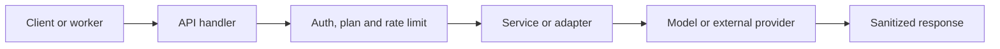

# Servicios y APIs centrales

**Backlog:** [DOC-010](https://github.com/jggjosue/prompt-studio/issues/42) · [backlog principal](https://github.com/jggjosue/prompt-studio/issues/32)

Esta guía ubica la frontera HTTP, el servicio que implementa la regla de
negocio y el contrato persistente de los dominios centrales. Para conocer la
autorización exacta de una ruta, consulta la matriz generada
[API_ACCESS.md](../API_ACCESS.md); no copies sus reglas aquí.

## Mapa de dominios

| Dominio | API y adaptadores | Servicios y contratos | Persistencia y documentación relacionada |
|---|---|---|---|
| Jobs de IA | [`/api/ai/jobs`](../../src/app/api/ai/jobs/route.ts), [process](../../src/app/api/ai/jobs/process/route.ts), [progress](<../../src/app/api/ai/jobs/[id]/progress/route.ts>) | [`ai-job-config`](../../src/lib/ai-job-config.ts), [`ai-job-service`](../../src/lib/ai-job-service.ts), [`ai-job-runner`](../../src/lib/ai-job-runner.ts), [`output-contract`](../../src/lib/output-contract.ts) | [`AIGenerationJob`](../../src/models/AIGenerationJob.ts), [`AICreditAccount`](../../src/models/AICreditAccount.ts), [`AICreditLedger`](../../src/models/AICreditLedger.ts), [AI Generation playbook](AI_GENERATION.md) |
| Editor y proyectos | [`/api/editor/projects`](../../src/app/api/editor/projects/route.ts) | [`src/lib/editor`](../../src/lib/editor), [`use-editor-autosave`](../../src/hooks/use-editor-autosave.ts), [`cache-policy`](../../src/lib/cache-policy.ts) | [`EditorProject`](../../src/models/EditorProject.ts), [Visual Editor playbook](VISUAL_EDITOR.md) |
| Biblioteca de componentes | [`/api/component-library`](../../src/app/api/component-library/route.ts), [export](../../src/app/api/component-library/export/route.ts) | [`use-component-library`](../../src/hooks/use-component-library.ts), [`use-component-catalog-data`](../../src/hooks/use-component-catalog-data.ts) | [`ComponentLibrary`](../../src/models/ComponentLibrary.ts), [Priority feature components](PRIORITY_FEATURE_COMPONENTS.md) |
| Créditos y Stripe | [`/api/credits`](../../src/app/api/credits/route.ts), [checkout](../../src/app/api/credits/checkout/route.ts), [Stripe webhook](../../src/app/api/webhooks/stripe/route.ts), [`/api/subscription`](../../src/app/api/subscription) | [`stripe`](../../src/lib/stripe.ts), [`credit-packs`](../../src/lib/credit-packs.ts), [`credit-topup`](../../src/lib/credit-topup.ts), [`server-subscription-status`](../../src/lib/server-subscription-status.ts) | [`CreditPurchase`](../../src/models/CreditPurchase.ts), [`AICreditAccount`](../../src/models/AICreditAccount.ts), [Stripe Payments playbook](STRIPE_PAYMENTS.md) |
| Afiliados | [applications](../../src/app/api/affiliate/applications/route.ts), [click](../../src/app/api/affiliate/click/route.ts), [admin sales](../../src/app/api/admin/affiliate-sales/route.ts) | [`affiliate`](../../src/lib/affiliate.ts), [`affiliate-mongo`](../../src/lib/affiliate-mongo.ts), [`affiliate-referral`](../../src/lib/affiliate-referral.ts) | [`AffiliateApplication`](../../src/models/AffiliateApplication.ts), datos de comisión en Clerk y Mongo |
| Configuración y plataforma | [`/api/cache`](../../src/app/api/cache), [`/api/r2/buckets`](../../src/app/api/r2/buckets/route.ts), [`/api/output-contracts`](../../src/app/api/output-contracts/route.ts) | [`rate-limit`](../../src/lib/rate-limit.ts), [`cache-policy`](../../src/lib/cache-policy.ts), [`r2-storage`](../../src/lib/r2-storage.ts), [`observability-server`](../../src/lib/observability-server.ts) | [`mongoose`](../../src/lib/mongoose.ts), [Data Persistence playbook](DATA_PERSISTENCE.md), [Runtime entry points](../audits/RUNTIME_ENTRY_POINTS.md) |

## Flujo de una operación de servicio



1. El handler autentica y limita antes de ejecutar trabajo costoso o escribir.
2. El servicio concentra reglas reutilizables: crédito, idempotencia, precios,
   transformación o integración externa.
3. El modelo aplica los límites e índices de persistencia; las consultas de
   recursos por usuario incluyen `userId`.
4. Las respuestas privadas usan la política `private, no-store` definida en
   [`cache-policy`](../../src/lib/cache-policy.ts).

## Reglas de cambio por dominio

| Cambio | Actualizar o verificar |
|---|---|
| Nueva ruta API | Handler, mecanismo en [API_ACCESS.md](../API_ACCESS.md), rate limit/cache, test de contrato y fila de este mapa si introduce un servicio central |
| Nuevo proveedor o tipo de job | `ai-job-config`, runner, output contract, costo, idempotencia y el [AI Generation playbook](AI_GENERATION.md) |
| Nuevo pago o pack de créditos | Catálogo de packs, checkout, validación del webhook y ledger; no aceptar precio o créditos desde el cliente |
| Nueva operación del editor/biblioteca | Hook de cliente, endpoint, guard de plan/sesión, saneado y límites del modelo |
| Nueva integración externa | Adapter/servicio, variables de entorno, observabilidad y semántica de reintento |

## Verificación mínima

```bash
node scripts/mjs/build-route-access-matrix.mjs
node --import tsx --test tests/unit/route-access-matrix.test.ts
node --import tsx --test tests/unit/api-security-contracts.test.ts
npm run typecheck
```
