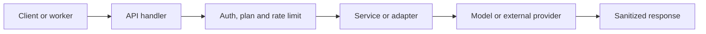

# Servicios y APIs centrales

**Backlog:** [DOC-010](https://github.com/jggjosue/prompt-studio/issues/42) · [backlog principal](https://github.com/jggjosue/prompt-studio/issues/32)

Esta guía ubica la frontera HTTP, el servicio que implementa la regla de
negocio y el contrato persistente de los dominios centrales. Para conocer la
autorización exacta de una ruta, consulta la matriz generada
[API_ACCESS.md](../API_ACCESS.md); no copies sus reglas aquí.

## Mapa de dominios

| Dominio | API y adaptadores | Servicios y contratos | Persistencia y documentación relacionada |
|---|---|---|---|
| Jobs de IA | [`/api/ai/jobs`](../../src/app/api/ai/jobs/route.ts), [process](../../src/app/api/ai/jobs/process/route.ts), [progress](<../../src/app/api/ai/jobs/[id]/progress/route.ts>) | [`ai-job-config`](../../src/lib/ai-job-config.ts), [`ai-job-service`](../../src/lib/ai-job-service.ts), [`ai-job-runner`](../../src/lib/ai-job-runner.ts), [`output-contract`](../../src/lib/output-contract.ts) | [`AIGenerationJob`](../../src/models/AIGenerationJob.ts), [`AICreditAccount`](../../src/models/AICreditAccount.ts), [`AICreditLedger`](../../src/models/AICreditLedger.ts), [AI Generation playbook](AI_GENERATION.md) |
| Editor y proyectos | [`/api/editor/projects`](../../src/app/api/editor/projects/route.ts) | [`src/lib/editor`](../../src/lib/editor), [`use-editor-autosave`](../../src/hooks/use-editor-autosave.ts), [`cache-policy`](../../src/lib/cache-policy.ts) | [`EditorProject`](../../src/models/EditorProject.ts), [Visual Editor playbook](VISUAL_EDITOR.md) |
| Proyectos y Brand Kits | [`/api/projects`](../../src/app/api/projects/route.ts), [project detail](<../../src/app/api/projects/[id]/route.ts>), [`/api/brand-kits`](../../src/app/api/brand-kits/route.ts), [brand kit detail](<../../src/app/api/brand-kits/[id]/route.ts>) | [`project-context`](../../src/lib/project-context.ts), [`project-budget`](../../src/lib/project-budget.ts), [`project-collaboration`](../../src/lib/project-collaboration.ts), [`project-decision`](../../src/lib/project-decision.ts), [`brand-kit`](../../src/lib/brand-kit.ts) | [`CreativeProject`](../../src/models/CreativeProject.ts), [`BrandKit`](../../src/models/BrandKit.ts), [Priority feature components](PRIORITY_FEATURE_COMPONENTS.md) |
| Biblioteca de componentes | [`/api/component-library`](../../src/app/api/component-library/route.ts), [export](../../src/app/api/component-library/export/route.ts) | [`use-component-library`](../../src/hooks/use-component-library.ts), [`use-component-catalog-data`](../../src/hooks/use-component-catalog-data.ts) | [`ComponentLibrary`](../../src/models/ComponentLibrary.ts), [Priority feature components](PRIORITY_FEATURE_COMPONENTS.md) |
| Biblioteca, guardados y activos | [`/api/saved`](../../src/app/api/saved/route.ts), [`/api/assets/provenance`](../../src/app/api/assets/provenance/route.ts), [`/api/purchases/download`](../../src/app/api/purchases/download/route.ts) | [`asset-provenance-server`](../../src/lib/asset-provenance-server.ts), [`asset-provenance`](../../src/lib/asset-provenance.ts), [`purchase-download-token`](../../src/lib/purchase-download-token.ts), [`web-page-download`](../../src/lib/web-page-download.ts) | [`AssetProvenance`](../../src/models/AssetProvenance.ts), [`CreditPurchase`](../../src/models/CreditPurchase.ts), [Data Persistence playbook](DATA_PERSISTENCE.md) |
| Créditos y Stripe | [`/api/credits`](../../src/app/api/credits/route.ts), [checkout](../../src/app/api/credits/checkout/route.ts), [Stripe webhook](../../src/app/api/webhooks/stripe/route.ts), [`/api/subscription`](../../src/app/api/subscription) | [`stripe`](../../src/lib/stripe.ts), [`credit-packs`](../../src/lib/credit-packs.ts), [`credit-topup`](../../src/lib/credit-topup.ts), [`server-subscription-status`](../../src/lib/server-subscription-status.ts) | [`CreditPurchase`](../../src/models/CreditPurchase.ts), [`AICreditAccount`](../../src/models/AICreditAccount.ts), [Stripe Payments playbook](STRIPE_PAYMENTS.md) |
| Suscripciones y facturación | [subscription status](../../src/app/api/subscription/status/route.ts), [portal](../../src/app/api/subscription/portal/route.ts), [invoice](../../src/app/api/subscription/invoice/route.ts), [component checkout](../../src/app/api/component-checkout/route.ts), [web page checkout](../../src/app/api/web-page-checkout/route.ts) | [`subscription-storage`](../../src/lib/subscription-storage.ts), [`subscription-status-cache`](../../src/lib/subscription-status-cache.ts), [`subscription-plans`](../../src/lib/subscription-plans.ts), [`stripe-checkout`](../../src/lib/stripe-checkout.ts), [`clerk-billing-server`](../../src/lib/clerk-billing-server.ts) | [`CreditPurchase`](../../src/models/CreditPurchase.ts), [`AICreditLedger`](../../src/models/AICreditLedger.ts), [Stripe Payments playbook](STRIPE_PAYMENTS.md) |
| Prompt Lab y evaluaciones | [`/api/prompt-versions`](../../src/app/api/prompt-versions/route.ts), [`/api/prompt-experiments`](../../src/app/api/prompt-experiments/route.ts), [experiment detail](<../../src/app/api/prompt-experiments/[id]/route.ts>), [`/api/human-evaluations`](../../src/app/api/human-evaluations/route.ts), [`/api/evaluation-suites`](../../src/app/api/evaluation-suites/route.ts) | [`prompt-versioning`](../../src/lib/prompt-versioning.ts), [`prompt-experiment`](../../src/lib/prompt-experiment.ts), [`prompt-validation`](../../src/lib/prompt-validation.ts), [`evaluation-suite`](../../src/lib/evaluation-suite.ts), [`human-preferences`](../../src/lib/human-preferences.ts) | [`PromptVersion`](../../src/models/PromptVersion.ts), [`PromptExperiment`](../../src/models/PromptExperiment.ts), [`HumanEvaluation`](../../src/models/HumanEvaluation.ts), [`ModelRegression`](../../src/models/ModelRegression.ts) |
| Campañas y publicación | [`/api/campaign-workflows`](../../src/app/api/campaign-workflows/route.ts), [campaign detail](<../../src/app/api/campaign-workflows/[id]/route.ts>), [`/api/publications`](../../src/app/api/publications/route.ts), [publication detail](<../../src/app/api/publications/[id]/route.ts>), [`/api/publication-quality`](../../src/app/api/publication-quality/route.ts) | [`campaign-orchestrator`](../../src/lib/campaign-orchestrator.ts), [`campaign-control-center`](../../src/lib/campaign-control-center.ts), [`landing-publishing`](../../src/lib/landing-publishing.ts), [`publication-quality`](../../src/lib/publication-quality.ts), [`project-budget`](../../src/lib/project-budget.ts) | [`CampaignWorkflow`](../../src/models/CampaignWorkflow.ts), [`LandingPublication`](../../src/models/LandingPublication.ts), [`PublicationQualityAudit`](../../src/models/PublicationQualityAudit.ts), [`ProjectClientLink`](../../src/models/ProjectClientLink.ts) |
| Catálogo, búsqueda y descubrimiento | [`/api/catalog/[kind]`](<../../src/app/api/catalog/[kind]/route.ts>), [`/api/catalog-engagement`](../../src/app/api/catalog-engagement/route.ts), [`/api/recommendations`](../../src/app/api/recommendations/route.ts), [`/api/search/intent`](../../src/app/api/search/intent/route.ts), [`/api/landing-pages/catalog`](../../src/app/api/landing-pages/catalog/route.ts) | [`prompt-catalog`](../../src/lib/prompt-catalog.ts), [`catalog-facet-index`](../../src/lib/catalog-facet-index.ts), [`catalog-ranking`](../../src/lib/catalog-ranking.ts), [`catalog-search-index`](../../src/lib/catalog-search-index.ts), [`personalized-recommendations`](../../src/lib/personalized-recommendations.ts), [`search-intent`](../../src/lib/search-intent.ts) | [`CatalogLike`](../../src/models/CatalogLike.ts), [`UserInterest`](../../src/models/UserInterest.ts), [`ProductReview`](../../src/models/ProductReview.ts), [Priority feature components](PRIORITY_FEATURE_COMPONENTS.md) |
| Marketplace y creadores | [`/api/marketplace`](../../src/app/api/marketplace/route.ts), [`/api/creator/listings`](../../src/app/api/creator/listings/route.ts), [admin marketplace](../../src/app/api/admin/marketplace/route.ts), [`/api/product-reviews`](../../src/app/api/product-reviews/route.ts), [my reviews](../../src/app/api/product-reviews/me/route.ts) | [`creator-marketplace`](../../src/lib/creator-marketplace.ts), [`marketplace-admin`](../../src/lib/marketplace-admin.ts), [`product-reviews`](../../src/lib/product-reviews.ts), [`product-social-proof`](../../src/lib/product-social-proof.ts), [`review-moderation`](../../src/lib/review-moderation.ts) | [`MarketplaceListing`](../../src/models/MarketplaceListing.ts), [`MarketplaceSale`](../../src/models/MarketplaceSale.ts), [`ProductReview`](../../src/models/ProductReview.ts), [`RegisteredUser`](../../src/models/RegisteredUser.ts) |
| Afiliados | [applications](../../src/app/api/affiliate/applications/route.ts), [click](../../src/app/api/affiliate/click/route.ts), [admin sales](../../src/app/api/admin/affiliate-sales/route.ts) | [`affiliate`](../../src/lib/affiliate.ts), [`affiliate-mongo`](../../src/lib/affiliate-mongo.ts), [`affiliate-referral`](../../src/lib/affiliate-referral.ts) | [`AffiliateApplication`](../../src/models/AffiliateApplication.ts), datos de comisión en Clerk y Mongo |
| Observabilidad, experimentos y analítica | [`/api/observability/events`](../../src/app/api/observability/events/route.ts), [admin observability](../../src/app/api/admin/observability/route.ts), [feature experiments](../../src/app/api/admin/feature-experiments/route.ts), [main funnel](../../src/app/api/admin/main-funnel/route.ts), [`/api/feature-flags`](../../src/app/api/feature-flags/route.ts) | [`observability-client`](../../src/lib/observability-client.ts), [`observability-server`](../../src/lib/observability-server.ts), [`observability-safety`](../../src/lib/observability-safety.ts), [`feature-experiments`](../../src/lib/feature-experiments.ts), [`main-funnel`](../../src/lib/main-funnel.ts) | [`FeatureExperiment`](../../src/models/FeatureExperiment.ts), [`FeatureAssignment`](../../src/models/FeatureAssignment.ts), [`ProjectFunnelEvent`](../../src/models/ProjectFunnelEvent.ts), [observability](../observability.md) |
| Configuración y plataforma | [`/api/cache`](../../src/app/api/cache), [`/api/r2/buckets`](../../src/app/api/r2/buckets/route.ts), [`/api/output-contracts`](../../src/app/api/output-contracts/route.ts) | [`rate-limit`](../../src/lib/rate-limit.ts), [`cache-policy`](../../src/lib/cache-policy.ts), [`r2-storage`](../../src/lib/r2-storage.ts), [`observability-server`](../../src/lib/observability-server.ts) | [`mongoose`](../../src/lib/mongoose.ts), [Data Persistence playbook](DATA_PERSISTENCE.md), [Runtime entry points](../audits/RUNTIME_ENTRY_POINTS.md) |

## Flujo de una operación de servicio



1. El handler autentica y limita antes de ejecutar trabajo costoso o escribir.
2. El servicio concentra reglas reutilizables: crédito, idempotencia, precios,
   transformación o integración externa.
3. El modelo aplica los límites e índices de persistencia; las consultas de
   recursos por usuario incluyen `userId`.
4. Las respuestas privadas usan la política `private, no-store` definida en
   [`cache-policy`](../../src/lib/cache-policy.ts).

## Reglas de cambio por dominio

| Cambio | Actualizar o verificar |
|---|---|
| Nueva ruta API | Handler, mecanismo en [API_ACCESS.md](../API_ACCESS.md), rate limit/cache, test de contrato y fila de este mapa si introduce un servicio central |
| Nuevo proveedor o tipo de job | `ai-job-config`, runner, output contract, costo, idempotencia y el [AI Generation playbook](AI_GENERATION.md) |
| Nuevo pago o pack de créditos | Catálogo de packs, checkout, validación del webhook y ledger; no aceptar precio o créditos desde el cliente |
| Nueva operación del editor/biblioteca | Hook de cliente, endpoint, guard de plan/sesión, saneado y límites del modelo |
| Nueva integración externa | Adapter/servicio, variables de entorno, observabilidad y semántica de reintento |

## Verificación mínima

```bash
node scripts/mjs/build-route-access-matrix.mjs
node --import tsx --test tests/unit/route-access-matrix.test.ts
node --import tsx --test tests/unit/api-security-contracts.test.ts
npm run typecheck
```
