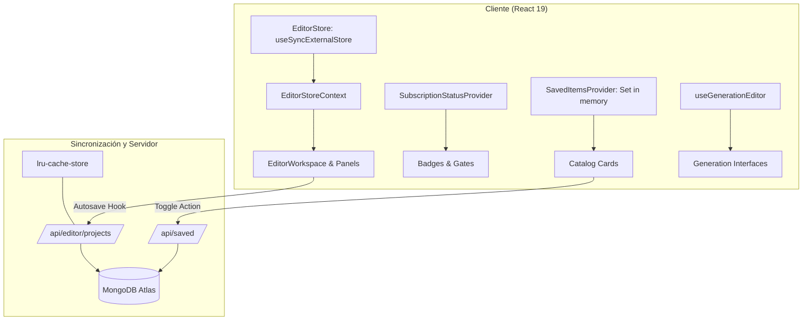

# Gestión de estado en el cliente y servidor

**Backlog:** [DOC-011](https://github.com/jggjosue/prompt-studio/issues/43) · [backlog principal](https://github.com/jggjosue/prompt-studio/issues/32)

Esta guía explica la estrategia de gestión de estado en Prompt Studio: stores en el cliente, contextos de React, sincronización externa (`useSyncExternalStore`), cachés de sesión y cachés de servidor.

---

## 1. Principios arquitectónicos de estado

1. **Evitar dependencias externas innecesarias**: En lugar de librerías globales pesadas (Redux, Zustand) para toda la aplicación, se utiliza el estándar de React 19 (`useSyncExternalStore`, React Context, hooks desacoplados).
2. **Separación de responsabilidades**:
   - El estado del documento (lo que se serializa y persiste) está separado del estado efímero de interfaz (paneles, zoom, selección, hover).
   - El historial de deshacer/rehacer opera sobre comandos del documento y no sobre interacciones visuales efímeras.
3. **Optimización granular de renders**:
   - `useSyncExternalStore` permite suscripción selectiva en el editor visual para evitar re-renderizar nodos inactivos durante mutaciones.
4. **Agrupación de lecturas remotas**:
   - Estados de catálogo y guardados compartidos se resuelven una única vez por sesión/montaje mediante proveedores (`SavedItemsProvider`, `SubscriptionStatusProvider`) en lugar de consultas individuales por componente o tarjeta.

---

## 2. Mapa de mecanismos de estado

| Mecanismo | Implementación | Propósito y ciclo de vida | Consumidores principales |
|---|---|---|---|
| **Editor Visual Store** (`useSyncExternalStore`) | [`src/lib/editor/store.ts`](../../src/lib/editor/store.ts)<br>[`src/components/editor/editor-store-context.tsx`](../../src/components/editor/editor-store-context.tsx) | Árbol normalizado de nodos, selección múltiple, modo preview, breakpoint, paneles UI, comandos e historial de deshacer/rehacer. Vive fuera del árbol de renderizado de React. | [`EditorWorkspace`](../../src/components/editor/editor-workspace.tsx), [`EditorShell`](../../src/components/editor/editor-shell.tsx), [`InspectorPanel`](../../src/components/editor/inspector-panel.tsx), [`EditorCanvas`](../../src/components/editor/editor-canvas.tsx) |
| **Historial de Comandos** (Undo / Redo) | [`src/lib/editor/history.ts`](../../src/lib/editor/history.ts) | Pila de comandos reversibles con límite de historial. Se ejecuta dentro del store del editor. | Store del editor y atajos de teclado / toolbar. |
| **Caché y Store de Suscripción** | [`src/lib/subscription-status-cache.ts`](../../src/lib/subscription-status-cache.ts)<br>[`src/components/subscription-status-provider.tsx`](../../src/components/subscription-status-provider.tsx) | Snapshot de estado de suscripción (plan, ciclo, páginas compradas) cacheado en memoria y `sessionStorage`, sincronizado con Clerk. | [`SubscriptionStatusProvider`](../../src/components/subscription-status-provider.tsx), badges de plan, gates de navegación. |
| **Items Guardados** (Context + Set en memoria) | [`src/components/saved-items-provider.tsx`](../../src/components/saved-items-provider.tsx) | `Set<string>` en memoria con claves compuestas `kind:id` cargadas una sola vez desde `/api/saved`. | Tarjetas de prompts, componentes y recursos en catálogo. |
| **Hook de Generación Interactiva** | [`src/hooks/use-generation-editor.ts`](../../src/hooks/use-generation-editor.ts) | Estado local reactivo para prompts, parámetros del modelo, previsualización, estados de carga y feedback de generación. | Clientes en [`generate-images`](../../src/app/[locale]/generate-images/prompt-editor-client.tsx), [`generate-videos`](../../src/app/[locale]/generate-videos/generate-videos-client.tsx), [`generate-webs`](../../src/app/[locale]/generate-webs/generate-webs-client.tsx). |
| **Autoguardado de Proyectos** | [`src/hooks/use-editor-autosave.ts`](../../src/hooks/use-editor-autosave.ts) | Debounce, estado de guardado (`idle`, `dirty`, `saving`, `saved`, `error`) y sincronización con `/api/editor/projects`. | [`EditorWorkspace`](../../src/components/editor/editor-workspace.tsx). |
| **Caché LRU de Servidor** | [`src/lib/lru-cache-store.ts`](../../src/lib/lru-cache-store.ts)<br>[`src/lib/cache-namespace-policy.ts`](../../src/lib/cache-namespace-policy.ts) | Caché en RAM de Node.js por espacio de nombres con TTL, límites de entradas y expulsión LRU. | Servidores de API, rate limiters, respuestas calculadas. |
| **Índice de Legibilidad en Servidor** | [`src/lib/landing-readability-store.ts`](../../src/lib/landing-readability-store.ts) | Almacenamiento y caché en memoria y archivo JSON (`data/landing-readability.json`) de reportes de legibilidad bilingüe. | APIs y dashboards de análisis de legibilidad. |

---

## 3. Flujo y límites de responsabilidad



### Reglas de frontera
1. **No mezclar estado persistido con estado UI**: Por ejemplo, `EditorDocument` no almacena si el panel lateral izquierdo está colapsado o cuál es el nivel de zoom del usuario.
2. **Las mutaciones del documento se ejecutan mediante comandos**: Cualquier modificación estructural al árbol del editor visual pasa por `applyCommand` para garantizar que sea serializable y compatible con `history.ts`.
3. **Los contextos no deben crear cascadas de render**: Los contextos que cambian frecuentemente deben aislar sus selectores o utilizar suscripciones externas (`useSyncExternalStore`).

---

## 4. Verificación y pruebas asociadas

```bash
node --import tsx --test tests/unit/editor-core.test.ts
node --import tsx --test tests/unit/editor-ui-contracts.test.ts
npm run typecheck
```
