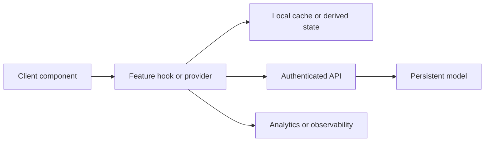

# Gestión de estado

**Backlog:** [DOC-011](https://github.com/jggjosue/prompt-studio/issues/43) · [backlog principal](https://github.com/jggjosue/prompt-studio/issues/32)

Esta guía explica dónde vive el estado de cliente, qué piezas lo pueden mutar y
cuándo debe cruzar a API, modelo persistente o caché de servidor. No documenta
cada `useState` local: se centra en stores, contextos y hooks que coordinan una
feature completa o que comparten datos entre componentes.

## Principios

1. El estado persistente vive en API y modelos; el estado de UI solo prepara,
   refleja u optimiza esa escritura.
2. Los providers transportan datos compartidos o referencias estables, no deben
   esconder autorización. La API sigue validando usuario, plan y permisos.
3. El estado derivado debe recalcularse desde la fuente canónica en vez de
   duplicarse en varios componentes.
4. Las actualizaciones optimistas deben tener reversión cuando falla el
   servidor.
5. Los hooks de feature deben exponer acciones pequeñas y nombradas; evita que
   los clientes muten estructuras internas directamente.

## Mapa de estado compartido

| Área | Implementación | Responsabilidad | Persistencia y límites |
|---|---|---|---|
| Editor visual | [`createEditorStore`](../../src/lib/editor/store.ts), [`EditorStoreProvider`](../../src/components/editor/editor-store-context.tsx), [`EditorWorkspace`](../../src/components/editor/editor-workspace.tsx) | Store externo con `useSyncExternalStore`, selectores por slice, historial, selección, viewport, runtime y comandos del documento. | El documento normalizado es la fuente exportable; [`use-editor-autosave`](../../src/hooks/use-editor-autosave.ts) persiste en [`/api/editor/projects`](../../src/app/api/editor/projects/route.ts) y [`EditorProject`](../../src/models/EditorProject.ts). |
| Biblioteca de componentes | [`use-component-library`](../../src/hooks/use-component-library.ts) | Favoritos, recientes, colecciones y proyectos de componentes con caché local, sincronización entre pestañas y guardado diferido. | `localStorage` es solo caché; la fuente de verdad autenticada es [`/api/component-library`](../../src/app/api/component-library/route.ts) y [`ComponentLibrary`](../../src/models/ComponentLibrary.ts). |
| Guardados y favoritos globales | [`SavedItemsProvider`](../../src/components/saved-items-provider.tsx), [`SaveItemButton`](../../src/components/save-item-button.tsx) | Carga una sola vez el conjunto guardado, comparte `Set` entre tarjetas y aplica toggles optimistas. | Revertir si falla [`/api/saved`](../../src/app/api/saved/route.ts). La clave compuesta evita colisiones entre tipos de recurso. |
| Estado de suscripción | [`SubscriptionStatusProvider`](../../src/components/subscription-status-provider.tsx), [`subscription-status-cache`](../../src/lib/subscription-status-cache.ts), [`use-stripe-subscription`](../../src/hooks/use-stripe-subscription.ts) | Snapshot estable de sesión, plan, carga y acceso comercial para evitar peticiones repetidas. | La API de sesión y billing sigue siendo canónica: [`/api/subscription/status`](../../src/app/api/subscription/status/route.ts). Limpia caché al cerrar sesión. |
| Generadores | [`use-generation-editor`](../../src/hooks/use-generation-editor.ts), [clientes de imagen](<../../src/app/[locale]/generate-images/prompt-editor-client.tsx>), [video](<../../src/app/[locale]/generate-videos/generate-videos-client.tsx>) y [web](<../../src/app/[locale]/generate-webs/generate-webs-client.tsx>) | Estado transitorio de progreso, resultado, errores y pestaña de salida. | Los jobs durables y el ledger pertenecen a [`/api/ai/jobs`](../../src/app/api/ai/jobs/route.ts), [`AIGenerationJob`](../../src/models/AIGenerationJob.ts), [`AICreditLedger`](../../src/models/AICreditLedger.ts). |
| Brand Kit en generadores | [`use-brand-kit-context`](../../src/hooks/use-brand-kit-context.ts) | Lee `brandKitId` desde URL y carga contexto textual para prompts y herramientas. | No autoriza ni guarda; delega en [`/api/brand-kits/[id]`](<../../src/app/api/brand-kits/[id]/route.ts>) y [`BrandKit`](../../src/models/BrandKit.ts). |
| Catálogo y búsqueda | [`use-catalog-search-url`](../../src/hooks/use-catalog-search-url.ts), [`use-catalog-facet-filter`](../../src/hooks/use-catalog-facet-filter.ts), [`use-fuzzy-filter`](../../src/hooks/use-fuzzy-filter.ts), [`use-keyset-pagination`](../../src/hooks/use-keyset-pagination.ts) | Mantiene query, filtros, facetado y paginación como estado derivado o URL state. | Para catálogos server-backed, la API canónica está en [`/api/catalog/[kind]`](<../../src/app/api/catalog/[kind]/route.ts>) y los servicios de ranking/búsqueda en [`src/lib`](../../src/lib). |
| Feature flags | [`use-feature-flags`](../../src/hooks/use-feature-flags.ts), [`/api/feature-flags`](../../src/app/api/feature-flags/route.ts) | Carga flags del usuario y expone helpers `variant` / `isEnabled`. | Las asignaciones persistentes viven en [`FeatureAssignment`](../../src/models/FeatureAssignment.ts) y [`FeatureExperiment`](../../src/models/FeatureExperiment.ts). |
| Toasts y feedback global | [`use-toast`](../../src/hooks/use-toast.ts), [`Toaster`](../../src/components/ui/toaster.tsx) | Cola efímera en memoria para notificaciones de UI. | No persistir ni usar como auditoría; los eventos importantes deben ir a observabilidad o modelo. |
| Responsive y viewport | [`use-mobile`](../../src/hooks/use-mobile.tsx), [`use-intersection-in-view`](../../src/hooks/use-intersection-in-view.ts), [`LazyInView`](../../src/components/lazy-in-view.tsx) | Estado de media queries, intersección y carga diferida. | Debe degradar en SSR y no reemplaza validación responsive visual/E2E. |

## Límite de responsabilidad



- El componente presenta y dispara acciones; no conoce detalles de persistencia.
- El hook/provider normaliza estado local, sincroniza caché y ofrece acciones.
- La API autentica, valida permisos y aplica límites del dominio.
- El modelo mantiene la fuente de verdad durable.
- La telemetría registra eventos principales, pero no debe ser necesaria para
  reconstruir el estado del producto.

## Reglas por tipo de cambio

| Si cambias… | Verifica también… |
|---|---|
| Store del editor | Selectores, historial, autosave, contrato del documento y [Visual Editor playbook](VISUAL_EDITOR.md). |
| Provider compartido | Estado inicial SSR, sesión de Clerk, limpieza al cerrar sesión y consumidores sin provider. |
| Hook con caché local | Estrategia de migración, sincronización entre pestañas, `pagehide`, reintentos y degradación sin `localStorage`. |
| Actualización optimista | Reversión ante fallo de red/API, estado de error visible y evento analítico correcto. |
| Estado en URL | Compatibilidad con navegación atrás/adelante, locale y enlaces compartibles. |
| Estado de billing o créditos | No confiar en valores del cliente; validar en API, Stripe/webhook y ledger. |

## Verificación mínima

```bash
npm test
npm run typecheck
```

Para cambios del editor, añade o ejecuta los tests específicos de contratos de
UI y core del editor:

```bash
node --import tsx --test tests/unit/editor-core.test.ts
node --import tsx --test tests/unit/editor-ui-contracts.test.ts
```
